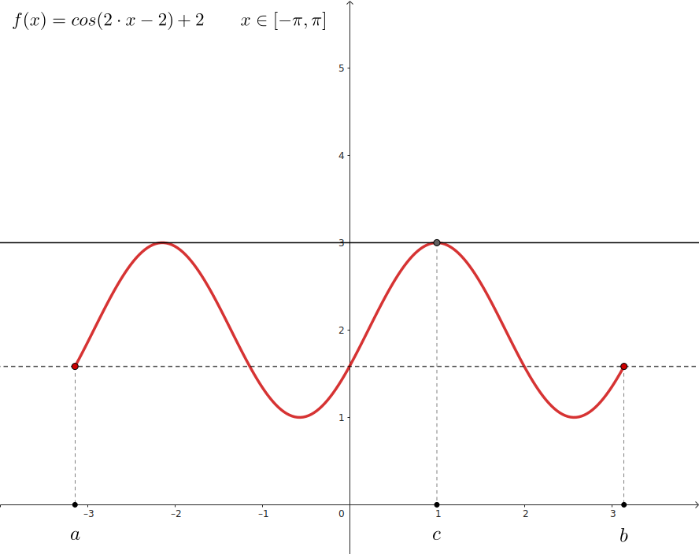
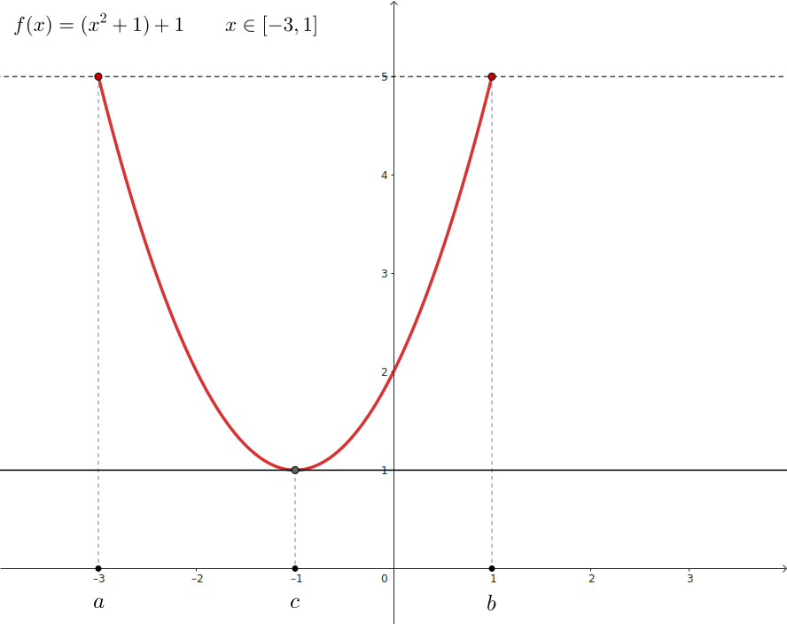
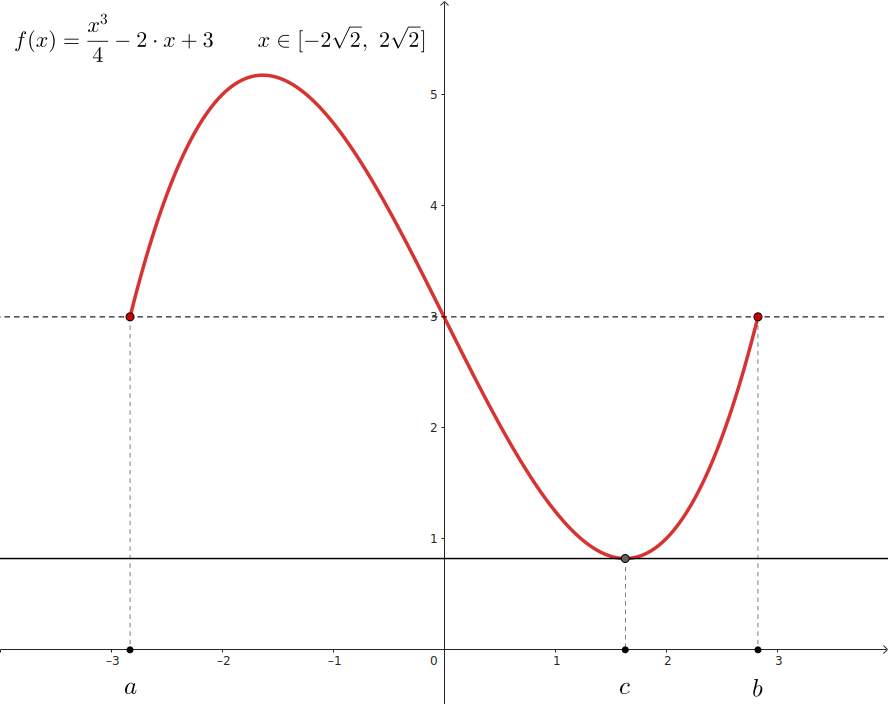

## Teorema de Rolle

Dada una funcion $f(x)$ que es:

- `continua` en el **intervalo cerrado** $[a, b]$
- `derivable` en el **intervalo abierto** $(a, b)$

Donde ademas $f(a) = f(b)$

**Existe** al menos un punto $c$ en el **intervalo abierto** $(a, b)$ que cumple que:

La `recta tangente` en el punto $c$ es **paralela** al **eje x**

$$
    \large{
        f'(c) = 0
    }
$$

 

### Ejemplos

 

Es un caso especial del `Teorema del valor medio`