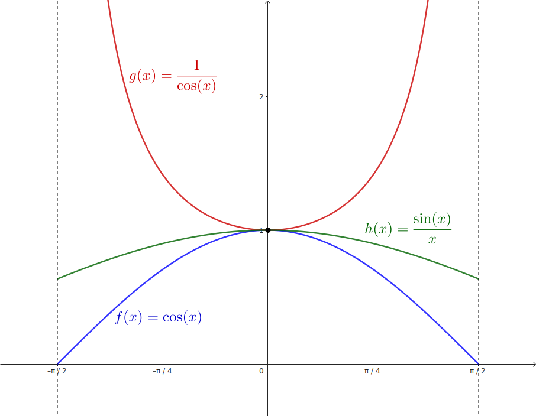
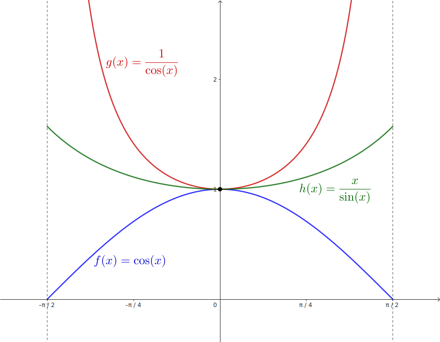
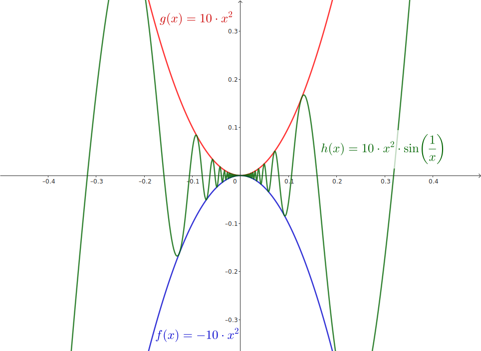

## Teorema del Emparedado

Sea $I$ un `intervalo` que contiene al `punto` $a$

Y sean $f$, $g$ y $h$ funciones definidas en $I$, exceptuando quizás el punto $a$

Si se cumple que, para todo $x$ pertenecientes a $I$ con $x \neq a$

$$
    f(x) \leq h(x) \leq g(x)
$$

y ademas

$$
    \lim_{x \to a} f(x) = \lim_{x \to a} g(x) = L
$$

entonces

$$
    \lim_{x \to a} h(x) = L
$$

#### Ejemplos

