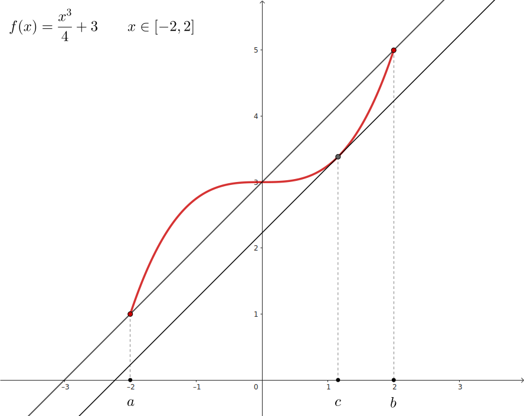
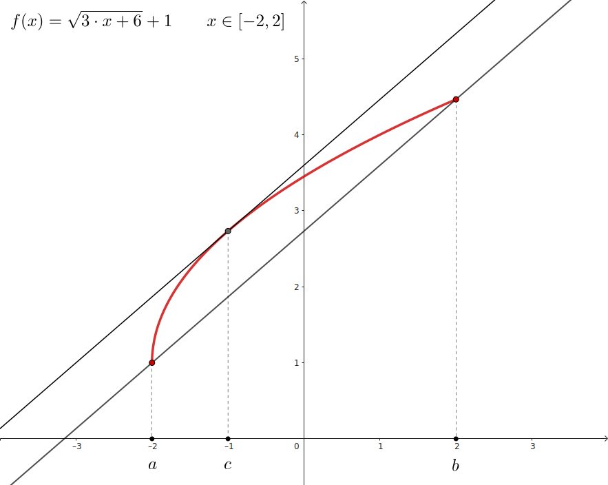
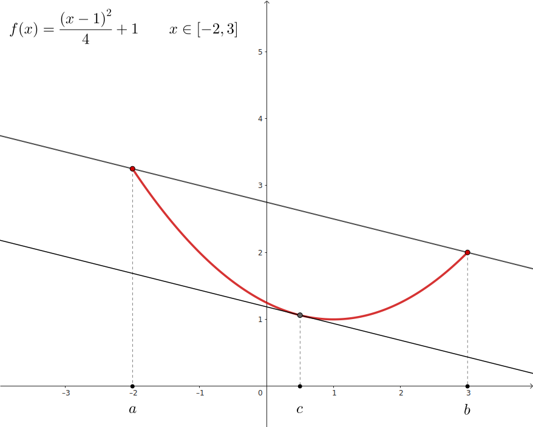

## Teorema del valor medio

Dada una funcion $f(x)$ que es:

- `continua` en el **intervalo cerrado** $[a, b]$
- `derivable` en el **intervalo abierto** $(a, b)$

**Existe** al menos un punto $c$ en el **intervalo abierto** $(a, b)$ que cumple que:

La `recta tangente` en el punto $c$ es **paralela** a la `recta secante` que pasa por los puntos $\{a, f(a)\}$ y $\{b, f(b)\}$ 

$$
    \Large{
        f'(c) = \frac{f(b) - f(a)}{b - a}
    }
$$

> $f'(c)$ es la `derivada`

> $\frac{f(b) - f(a)}{b - a}$ es la pendiente de la `recta secante`

 

### Ejemplos

