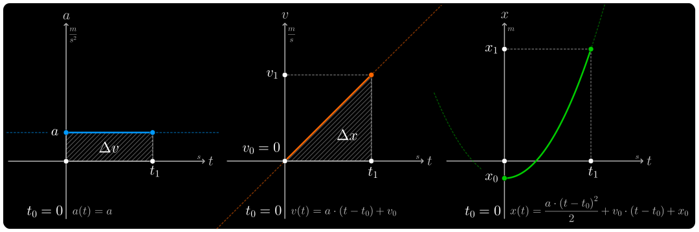
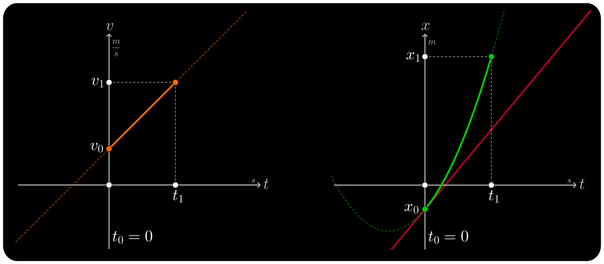
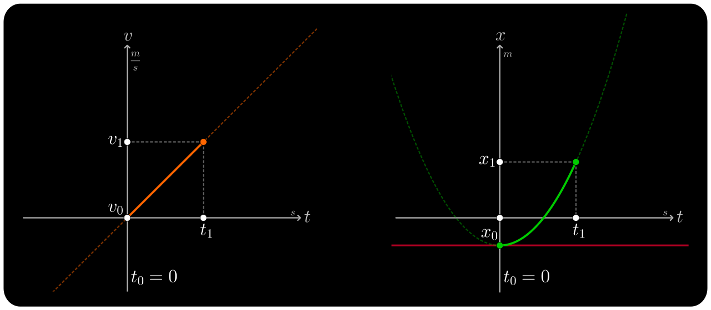
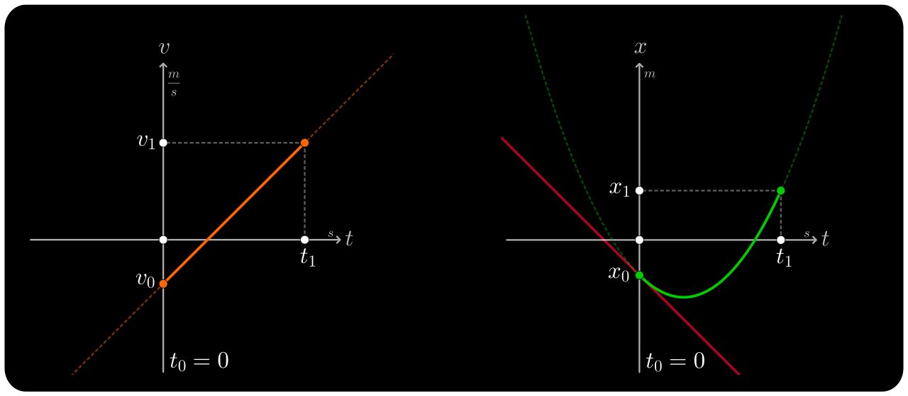
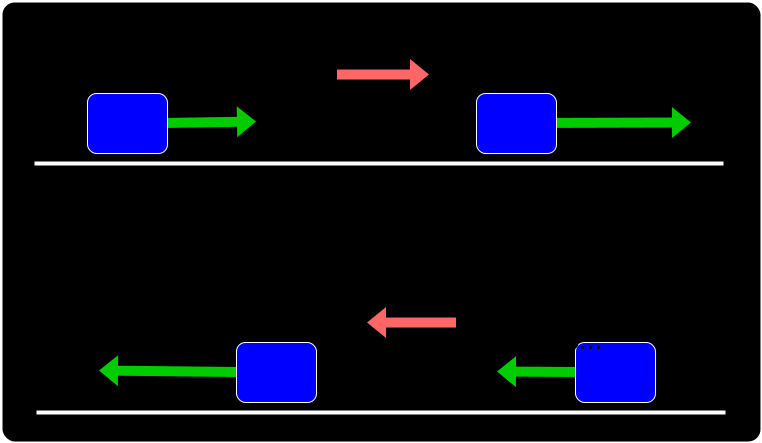
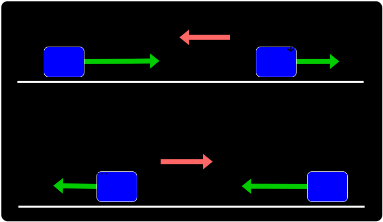

# Movimiento rectilineo uniformemente variado

- `Trayectoria`: Es una **linea recta**
- `Aceleracion`: Es **constante**

> Al ser la `Trayectoria` una **linea recta**: la `distancia recorrida` es igual al `desplazamiento`
>   
> Al ser la `Aceleracion` **constante**, la `aceleracion media` es igual a `aceleracion instantanea`

 

## Aceleracion

$$
\Large{
    {v_{1}}^{2} = {v_{0}}^{2} + 2 \cdot a \cdot \underbrace{(x_{1} - x_{0})}_{\Delta x}
}  
$$
> $v_1$ es la velocidad final
>  
> $v_0$ es la `velocidad inicial`

## Ecuaciones en funcion del `tiempo`

#### `Aceleracion` en funcion del `tiempo`
 

$$
    \Large{
        a(t) = a
    }
$$
 

#### `Velocidad` en funcion del `tiempo`
 

$$
    \Large{
        v(t) = a \cdot (t - t_{0}) + v_{0}
    }
$$
 

#### `Posicion` en funcion del `tiempo`
 

$$
    \Large{
        x(t) = \frac{a \cdot (t - t_{0})^{2}}{2} + v_{0} \cdot (t - t_{0}) + x_{0}
    }
$$
 

> $t_0$ es el `tiempo inicial`
>  
> $v_0$ es la `velocidad inicial`
>  
> $x_0$ es la `posicion inicial`
> 
 

## Graficas

### Grafica de `aceleracion`, `velocidad` y `posicion` en funcion del `tiempo`

 

### Grafica de la parabola segun la `velocidad inicial`

 

## ¿ Cuando aumenta la velocidad ?

La `velocidad` aumenta solamente cuando el **vector** `aceleracion` y el **vector** `velocidad` **apuntan hacia el mismo lado**

La `velocidad` disminuye cuando **apuntan en sentido contrario**

 

## Casos de `MRUV`

- Caida libre
- Tiro vertical

 

#### Docs

- [Fórmulas de MRUA - MRUV](https://www.youtube.com/watch?v=ex3Xq4e6q_c)

