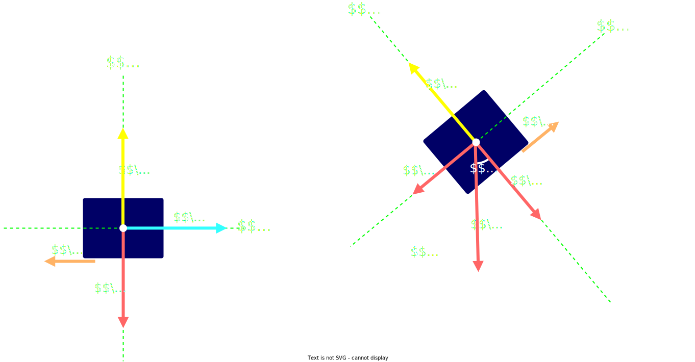

## Fuerza de rozamiento

Actua en **sentido contrario** al `movimiento`

Se produce como consecuencia de la **friccion** entre la **superficie del cuerpo** y la **superficie del plano** sobre el que se mueve o el **medio que atravieza** (solido, liquido, gaseoso)

$$
\Large{
    |\vec_{f}_r| = \mu * |\vec{N}|
}
$$
> $\vec{N}$ es la `fuerza normal`
>  
> $\mu$ es el `coeficiente de rozamiento`

 

#### Caracteristicas de la `fuerza de rozamiento`

- Es **proporcional** a la `fuerza normal`

- Es **independiente** del **area** de las superficies de contacto

- Es **independiente** de la `velocidad del movimiento`

- Actua siempre en sentido contrario al `movimiento`

- Depende de la `naturaleza` de las superficies de contacto y que tan **pulidas** o **rubosas** sean

 

## Coeficiente de rozamiento $\mu$

 

#### Tipos de Rozamiento

- `Rozamiendo estatico`: Aparece cuando se trata de poner un cuerpo en momiento partiendo desde el reposo

- `Rozamiento dinamico`: Aparece cuando el cuerpo se encuentra en movimiento

El `Rozamiendo estatico` es siempre mayor que el `Rozamiento dinamico`