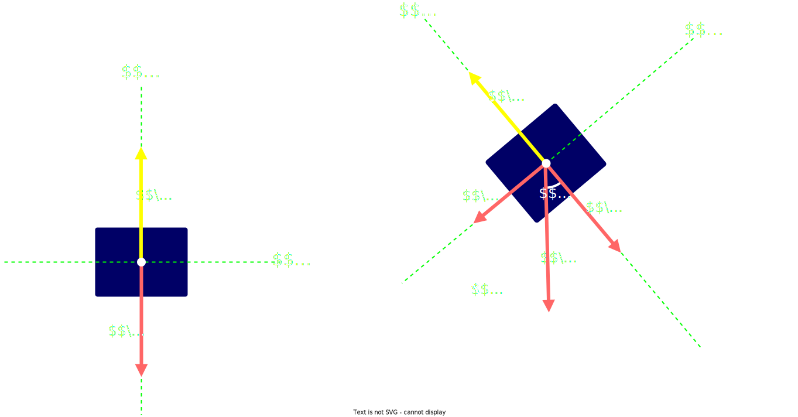

## Fuerza normal

Aparece siempre que un cuerpo esta **apoyado** sobre una `superficie` 

Es la `fuerza` que ejerce la `superficie` sobre el cuerpo y evita que la `superficie` se deforme

Es siempre **perpendicular** a la superficie o plano de apoyo

 

### Fuerza normal y el Peso

$$
|\vec{P}_{x}| = |\vec{P}| \cdot \sin(\alpha)
\hspace{2em}
|\vec{P}_{y}| = |\vec{P}| \cdot \cos(\alpha)
$$

> $\vec{P}_{x}$ es la **componente tangencial** del `peso`
>  
> $\vec{P}_{y}$ es la **componente normal** del `peso`
>  
> $\alpha$ es el `angulo de elevacion`

 

Cuando la fuerza que actua sobre el cuerpo es el `Peso` el **modulo** de la `Fuerza normal` es 

$$
\large{
    |\vec{N}| = |\vec{P}_{y}|
    \hspace{2em}
    |\vec{N}| = |\vec{P}| \cdot \cos(\alpha)
}
$$

 
y tambien se puede calcular como

$$
\Large{
    |\vec{N}| = M \cdot g \cdot \cos(\alpha)
}
$$
> $M$ es la `masa`
>  
> $g$ es la `aceleracion de la gravedad`
>  
> $\alpha$ es el `angulo de elevacion`

 

#### Docs

- [Fuerza normal](https://es.wikipedia.org/wiki/Fuerza_normal)
- [Fuerza normal](https://www.fisicalab.com/apartado/fuerza-normal)