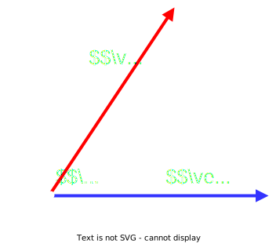
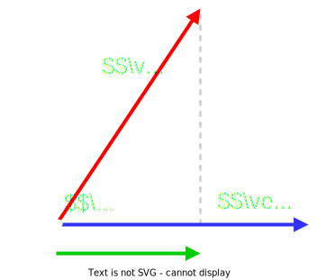
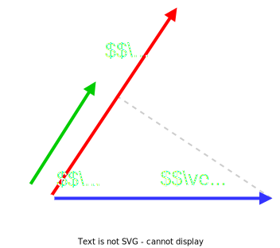

# Producto Escalar

Dados 2 **vectores** $\vec{a}$ y $\vec{v}$ de $n$ componentes en $\mathbb{R}^{n}$

$$
    \vec{a} = (a_1, a_2, \cdots, a_n)
    \hspace{2em}
    \vec{b} = (b_1, b_2, \cdots, b_n)
$$

el `producto escalar` se define como: 

$$
\Large {
    \vec{a} \bullet \vec{b} = \sum_{i=1}^{n} a_{i} \cdot b_{i}
}
$$

La suma de los productos de sus `componentes`

$$
\large {
    \vec{a} \bullet \vec{b} =  a_{1} \cdot b_{1} + a_{2} \cdot b_{2} + \cdots + a_{n} \cdot b_{n}
}
$$

 

## Producto escalar con modulo y angulo

El producto de los `modulos` por el coseno del angulo entre ellos

$$
\Large{
    \vec{a} \bullet \vec{b} = |\vec{a}| \cdot |\vec{b}| \cdot \cos(\alpha)
}   
$$

 

## Producto escalar como producto de matrices

Si tomamos los **vectores** $\vec{a}$ y $\vec{b}$ como `matrices` $A$ y $B$ de $n$ **filas**

El `producto escalar` es el **producto de las `matrices`**

$$
A \cdot B^{T} =
\begin{pmatrix}
    a_1 & a_2 & \cdots & a_n
\end{pmatrix}
\cdot
\begin{pmatrix}
    b_1 \\ b_2 \\ \vdots \\ b_n
\end{pmatrix}
$$

 

## Proyecciones de un vector sobre el otro

### Proyeccion de $\vec{a}$ sobre $\vec{b}$

$$
\Large {
    |\vec{a}| \cdot \cos(\alpha)
}
$$

 

### Proyeccion de $\vec{b}$ sobre $\vec{a}$

$$
\Large {
    |\vec{b}| \cdot \cos(\alpha)
}
$$

 

#### Docs 

- [Producto escalar](https://es.wikipedia.org/wiki/Producto_escalar)