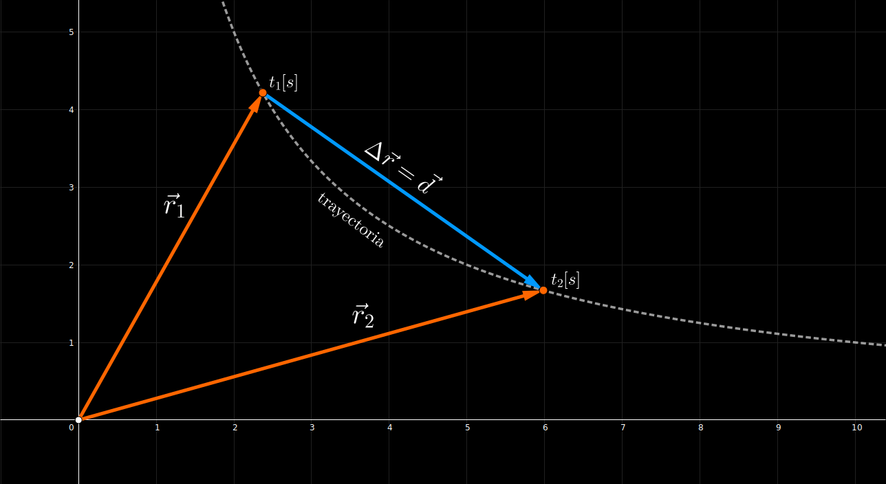

# Cinematica

Estudia el `movimiento` no la `fuerzas` que originan

## Cinematica de una Particula

#### Vectores de posicion 
$$
\begin{array}{l}
    \vec{r}_{1} = x_{1} \cdot \hat{i} + y_{1} \cdot \hat{j}
    &&
    \vec{r}_{2} = x_{2} \cdot \hat{i} + y_{2} \cdot \hat{j}
\end{array}
$$
 

#### Vector de desplazamiento 
$$
\begin{array}{c}
    \vec{d} = \Delta\vec{r} = \vec{r}_{2} - \vec{r}_{1}
    \hspace{2em} [m]
    \\\\
    \vec{d} = \Delta\vec{r} = 
    \underbrace{(x_{2} - x_{1})}_{\Delta x} \cdot \hat{i} 
    + 
    \underbrace{(y_{2} - y_{1})}_{\Delta y} \cdot \hat{j}
\end{array}
$$

## Velocidad

#### Velocidad media

$$
\Large{
    \vec{v}_{m} = \frac{\Delta\vec{r}}{\Delta t}
    \hspace{2em} [m/s]
}
$$

#### Velocidad instantanea

$$
\Large{
    \vec{v} = \lim_{\Delta t \to 0}  \frac{\Delta\vec{r}}{\Delta t} = \frac{d\vec{r}}{dt}
    \hspace{2em} [m/s]
}
$$
 

> $\Delta\vec{r}$ es el `desplazamiento`
>  
> $d\vec{r}$ vector diferencial de `desplazamiento`
>  
> $dt$ diferencial de `tiempo`

El vector $\vec{v}$ `velocidad instantanea` es tangente a la `trayectoria`

#### Rapidez

Es el **modulo** del `vector velocidad`

$$
\Large{
    |\vec{v}| = \sqrt{{v_{x}}^{2} + {v_{y}}^{2}}
    \hspace{2em} [m/s]
}
$$

 

## Aceleracion

#### Aceleracion media

$$
\Large{
    \vec{a}_{m} = \frac{\Delta\vec{v}}{\Delta t}
    \hspace{2em} \left[\tfrac{m}{s^{2}}\right]
}
$$

#### Aceleracion instantanea

$$
\Large{
    \vec{a} = \lim_{\Delta t \to 0} \frac{\Delta\vec{v}}{\Delta t}
    = \frac{d\vec{v}}{dt}
    \hspace{2em} \left[\tfrac{m}{s^{2}}\right]
}
$$
 

> $\Delta\vec{v}$ es el `cambio de velocidad`
>  
> $d\vec{v}$ vector diferencial de `velocidad`
>  
> $dt$ diferencial de `tiempo`

 

#### Docs

- [CINEMÁTICA DE LA PARTÍCULA](https://www.youtube.com/watch?v=i-lfqE_Edhg)