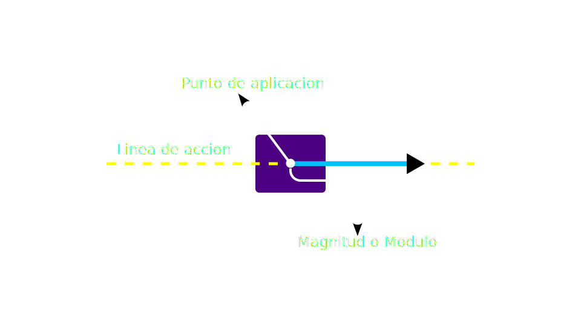

# Que son las `fuerzas`

Son **acciones** que **actuan sobre un cuerpo** y producen: 

- La **Deformacion del cuerpo**
  
- Un **cambio de movimiento** del cuerpo
  
- **Deformacion** y **cambio de movimiento** del cuerpo

 

### Caracteristicas

- son `magnitudes vectoriales`
  
- se **aplican de un cuerpo a otro**
  
- Nunca se puede producir una **fuerza aislada**, por lo que, el **numero de fuerzas** que actuan sobre un `sistema` es siempre **PAR**
  
- su unidad es el `Newton`

 

## Unidad de fuerzas - Newton

$$
\Large{
    1\hspace{0.2em}N = 1\hspace{0.2em}kg \cdot m / s^{2}
}   
$$

> Es la cantidad de fuerza que se nesesita para que una `masa` de $1\hspace{0.2em}kg$ obtenga una `aceleracion` de $1\hspace{0.2em}m/s$ por cada segundo

 

## Clasificacion de las fuerzas

### Segun su punto de aplicacion 

- `fuerzas de contacto`: Los cuerpos entran en contacto directo

- `fuerzas a distancia`: Los cuerpos no se tocan nunca

 

### Segun su duracion

- `fuerzas impulsivas`: Cuando el tiempo de aplicacion de la fuerza entre los cuerpos es breve
  
- `fuerzas de larga duracion`: Cuando el tiempo de aplicacion de la fuerza entre los cuerpos es largo

 

### Segun sus efectos

- `fuerzas motoras`: Cuando producen **movimiento**
  
- `fuerzas resistivas`: Cuando se oponen al **movimiento**

 

## Sistemas de fuerzas

#### Sistema de fuerzas concurrentes

Todas las `lineas de accion` de todas las `fuerzas` se cortan en un unico punto