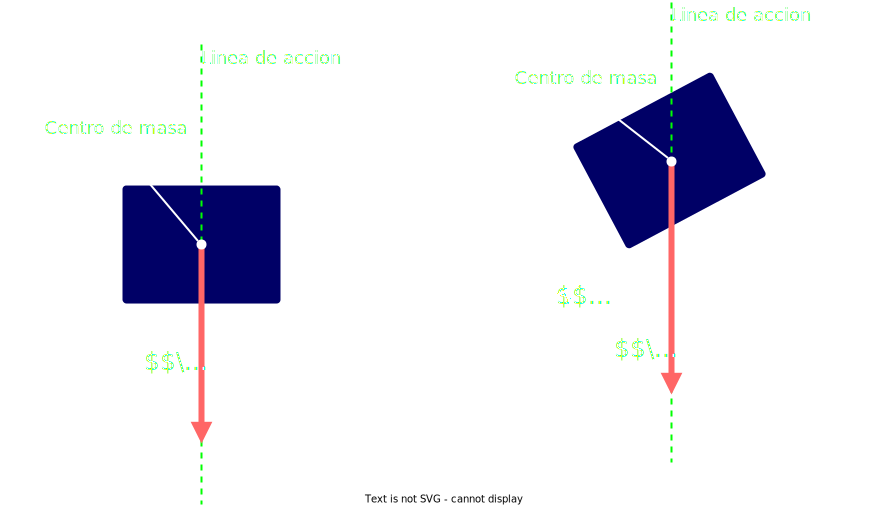

## Masa

Es la cantidad de `materia` 

- Es una `magnitud escalar`

- Es **invarible**
  
- Su unidad es el `Kilogramo` $kg$

 

## Peso

Es la `fuerza` con la que la tierra atrae a lo objetos

- Es una `magnitud vectorial`
  
- Su `linea de accion` o direccion es **vertical**
  
- Su `sentido` es **siempre hacia abajo**

- Su unidad es el `Newton` $N$

$$
\Large{
    |\vec{P}| = M \cdot g
}
$$
> $M$ es la `masa`
>  
> $g$ es la `aceleracion de la gravedad`

- Es variable, **cambia segun** el lugar en el universo **donde se encuentra el cuerpo**

 

