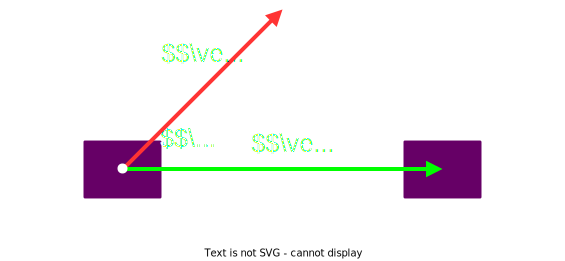
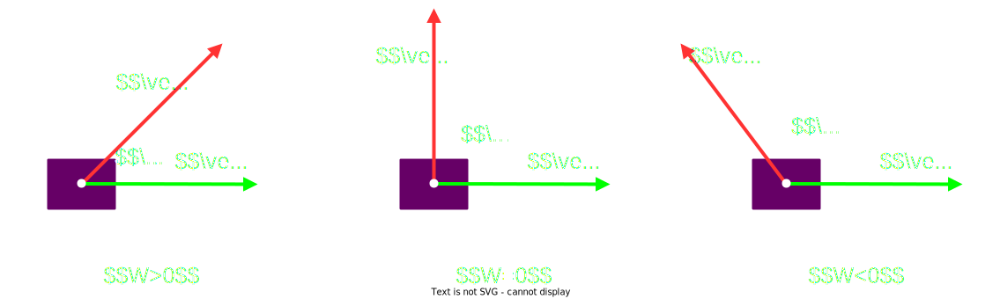

## Trabajo

`Producto escalar` de `fuerza` por el `desplazamiento`

$$
\Large {
    W = \vec{F} \cdot \vec{d}
}
$$

### El producto escalar se puede calcular como:

El modulo de los vectores y el angulo entre ellos
$$
\Large{
    W = |\vec{F}| \cdot |\vec{d}| \cdot cos(\alpha)
}
$$

La suma de las componentes de cada vector
$$
\begin{array}{c}
    \vec{F} = (F_x, F_y)
    \hspace{2em}
    \vec{d} = (d_x, d_y)
    \\\\  
    \Large{
        W = F_x \cdot d_x + F_y \cdot d_y
    }
\end{array}
$$

### Valores del `trabajo`

