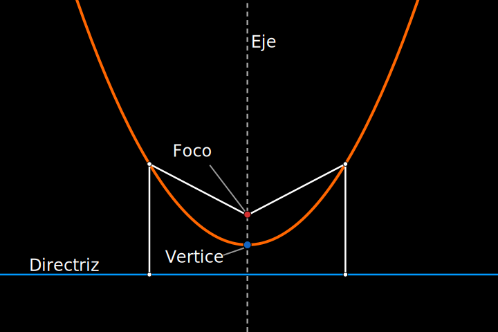
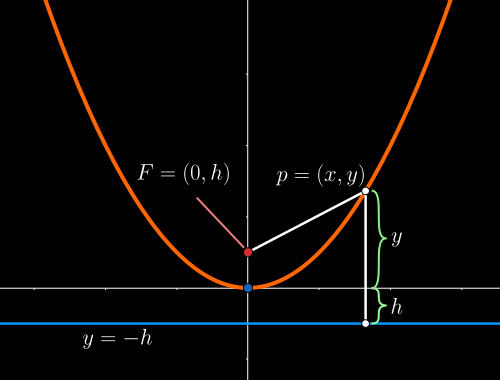

## Parabola

Conjunto de puntos que **equidistan** de un punto fijo llamado `foco` y una recta fija llamada `directriz`

El punto medio entre el `foco` y la `directriz` es el `vertice de la parabola`

La recta perpendicular a la `directriz` que pasa por el `vertice` y el `foco` es el `eje de la parabola`

$$
    x^{2} = 4 \cdot h \cdot y
    \hspace{2em}
    (x - x_{0})^{2} = 4 \cdot h \cdot (y - y_{0})
$$

 

### Ecuacion de la parabola

La distancia del `foco` al **punto generico** es

$$
    |\overset{}{FP}| = \sqrt{\displaystyle{x^{2} + (y - h)^{2}}}
$$

La distancia del **punto generico** a la **directriz** es

$$
    |y + h|
$$
Aplicando la **definicion de parabola** igualamos resolvemos y encontramos la **equacion de la parabola**
$$
\begin{array}{c}
    |y + h| = \sqrt{\displaystyle{x^{2} + (y - h)^{2}}}
    \\\\
    |y + h|^{2} = \sqrt{\displaystyle{x^{2} + (y - h)^{2}}}^{\hspace{0.2em}2}
    \\\\
    (y + h)^{2} = x^{2} + (y - h)^{2}
    \\\\
    y^{2} + 2 \cdot y \cdot h + h^{2} = x^{2} + y^{2} - 2 \cdot y \cdot h + h^{2}
    \\\\
    \cancel{y^{2}} + 2 \cdot y \cdot h + \cancel{h^{2}} = x^{2} + \cancel{y^{2}} - 2 \cdot y \cdot h + \cancel{h^{2}}
    \\\\
    2 \cdot y \cdot h + 2 \cdot y \cdot h = x^{2}
    \\\\
    x^{2} = 4 \cdot h \cdot y 
\end{array}
$$

 

### Parabola vertical y horizontal

- **Parabola vertical** con vertice en $P_{0} = (x_{0}, y_{0})$

    $$
        (x - x_{0})^{2} = 4 \cdot h \cdot (y - y_{0})
        \hspace{2em}
        y = a \cdot (x - x_{0})^{2} + y_{0}
    $$
 

- **Parabola horizontal** con vertice en $P_{0} = (x_{0}, y_{0})$

    $$
        (y - y_{0})^{2} = 4 \cdot h \cdot (x - x_{0})
        \hspace{2em}
        x = a \cdot (y - y_{0})^{2} + x_{0}
    $$