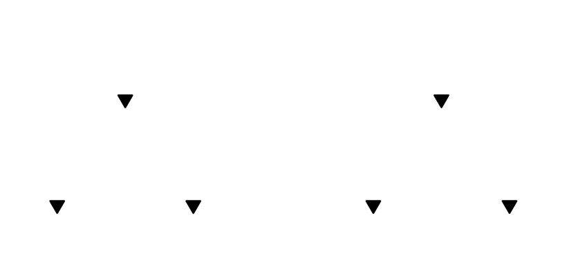
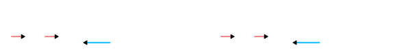

## Derivadas parciales

Cuando tenemos una `funcion` de **2 o mas** `variables independientes`

La `derivada parcial` consiste en derivar la funcion respecto a una `variable` y **tomar el resto como `constantes`**

por ejemplo dada la funcion $z = f(x, y)$ tenemos

- La `derivada parcial` respecto a $x$

    $$
        f_{x} = \dfrac{\partial f}{\partial x} = \dfrac{\partial z}{\partial x}
    $$

- La `derivada parcial` respecto a $y$

    $$
        f_{y} = \dfrac{\partial f}{\partial y} = \dfrac{\partial z}{\partial y}
    $$

### Notacion

- **Nombre de la funcion** con o sin los **apostrofes** y en el **subindice** la `variable` respecto a la cual se **deriva**:

    $$
        f_{x} = f'_{x}
        \hspace{1em}
        f_{y} = f'_{y}
        \hspace{3em}
        f_{x}^{2} = f''_{x}
        \hspace{1em}
        f_{y}^{2} = f''_{y}
    $$
  

- Usando la "D" de `Jacobi`: $\partial$
  
    $$
        \partial_{x} f
        \hspace{1em}
        \partial_{y} f
        \hspace{3em}
        \partial _{x}^{2}f
        \hspace{1em}
        \partial _{y}^{2}f
    $$
 

- Notacion de `Leibniz` con la "D" de `Jacobi`

    $$
        \dfrac{\partial f}{\partial x} = \dfrac{\partial z}{\partial x}
        \hspace{1.5em}
        \dfrac{\partial f}{\partial y} = \dfrac{\partial z}{\partial y}
        \hspace{2.5em}
        \dfrac{\partial^{2} f}{\partial x} = \dfrac{\partial^{2} z}{\partial x}
        \hspace{1.5em}
        \dfrac{\partial^{2} f}{\partial y} = \dfrac{\partial^{2} z}{\partial y}
    $$

 

## Definicion formal

Dada una funcion $f(x, y)$ un punto $P = (x_{0}, y_{0})$

$$
\large{
    \left.\dfrac{\partial f}{\partial x}\right|_{P} = \partial_{x} f(x_{0}, y_{0}) = \lim_{h \to 0} \dfrac{f(x_{0} + h, y_{0}) - f(x_{0}, y_{0})}{h}
}  
$$

$$
\large{
    \left.\dfrac{\partial f}{\partial y}\right|_{P} = \partial_{y} f(x_{0}, y_{0}) = \left.\dfrac{\partial f}{\partial x}\right|_{P} = \lim_{h \to 0} \dfrac{f(x_{0}, y_{0} + h) - f(x_{0}, y_{0})}{h}
}  
$$

 

### Ejemplo

$$
    f(x, y) = 3 \cdot x^{2} + 5 \cdot x \cdot y + 7 \cdot y^{2} + 3
$$

- `Derivada parcial` respecto a $x$
  
$$
\begin{array}{c}
    f_{x}(x, y) = 
    \underbrace{3 \cdot x^{2}}_{\displaystyle{3 \cdot 2 \cdot x}} 
    + 
    \underbrace{5 \cdot x \cdot y }_{\displaystyle{5 \cdot y \cdot 1}}
    + 
    \underbrace{7 \cdot y^{2} }_{\displaystyle{0}} 
    + 
    \underbrace{3}_{\displaystyle{0}}
    \\\\
    f_{x}(x, y) = 6 \cdot x + 5 \cdot y   
\end{array}
$$
 

- `Derivada parcial` respecto a $y$
  
$$
\begin{array}{c}
    f_{y}(x, y) = 
    \underbrace{3 \cdot x^{2}}_{\displaystyle{0}} 
    + 
    \underbrace{5 \cdot x \cdot y }_{\displaystyle{5 \cdot x \cdot 1}}
    + 
    \underbrace{7 \cdot y^{2} }_{\displaystyle{7 \cdot 2 \cdot y}} 
    + 
    \underbrace{3}_{\displaystyle{0}}
    \\\\
    f_{y}(x, y) = 5 \cdot x + 14 \cdot y   
\end{array}
$$
  

## Derivadas de orden superior

#### Orden de derivacion

> En notaciones como $f_{xy}$ y $\partial_{xy}f$ el **orden** en el que se **deriva** es de **derecha a izquierda**
>    
> En la notacion `Leibniz` el **orden** en el que se **deriva** es de **izquierda a derecha**

