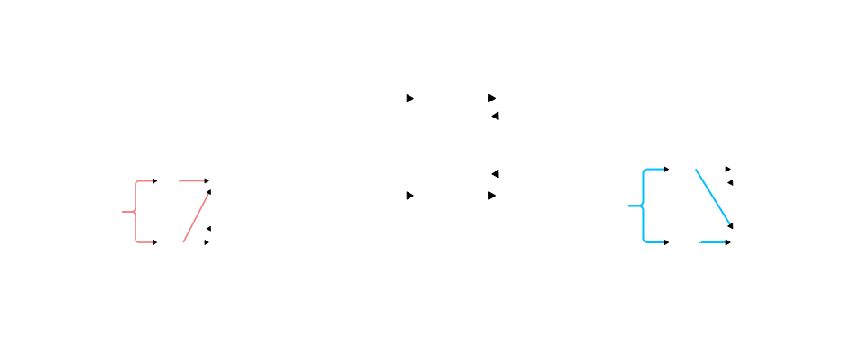
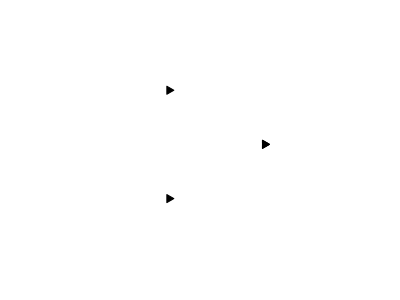

## Derivadas parciales en funciones compuestas

### Regla de la cadena en funciones de 1 variable

Si tenemos la composicion de $f(g)$ con $g(x)$

$$
    F(x) = (f \circ g)(x) = f(g(x))
$$

Encontramos la derivada aplicando la regla de la cadena: 

> *Derivar la funcion externa y multiplicar por la derivada de la funcion interna*

$$
    \dfrac{dF}{dx} = \frac{df}{du} \cdot \dfrac{du}{dx}
    \hspace{2em}
    F'(x) = f'(g(x)) \cdot g'(x)
$$

 

## Regla de la cadena en funciones de varias variables

Dada un funcion $f(u, w)$ en la que $u = u(x, y)$ y $w = w(x, y)$ 

$$
    z = f[u(x, y), w(x, y)] = F(x, y)
$$

Las `derivadas parciales` aplicando la `regla de la cadena` son:

- Respecto a $x$
    $$
    \partial_{x} F = \dfrac{\partial z}{\partial x} = 
    \dfrac{\partial f}{\partial u} \cdot \dfrac{\partial u}{\partial x}
    \hspace{0.5em} + \hspace{0.5em}
    \dfrac{\partial f}{\partial w} \cdot \dfrac{\partial w}{\partial x}
    $$
 

- Respecto a $y$
    $$
    \partial_{y} F = \dfrac{\partial z}{\partial y} = 
    \dfrac{\partial f}{\partial u} \cdot \dfrac{\partial u}{\partial y}
    \hspace{0.5em} + \hspace{0.5em}
    \dfrac{\partial f}{\partial w} \cdot \dfrac{\partial w}{\partial y}
    $$
 

> **Importante**   
> Si bien $f$ y $F$ son en esencia la misma funcion hay que tener en claro que:
>  
> - $f$ esta definida en funcion de $u$ y $w$:$\hspace{0.5em}z = f(u, v)$
>  
> - $F$ esta definida en funcion de $x$ y $y$:  $\hspace{0.5em}z = F(x, y)$

#### Arbol

> **Detalles**
>   
> - El **numero de terminos** es igual a la **cantidad de caminos** que van desde la `variable dependiente` a la `variable independiente`
>    
> - El **numero de factores** de cada **termino** es igual a al **numero de flechas** del camino

 

### Caso de 1 variable independiente

Dada un funcion $f(v, t)$ en la que $v = v(x)$ y $t = t(x)$ 

$$
    z = f[u(x), w(x)] = F(x)
$$

Las `derivada total` aplicando la `regla de la cadena` es:

$$
    F'=\dfrac{dz}{dx} = \dfrac{\partial f}{\partial v} \cdot \dfrac{\partial v}{\partial x} + \dfrac{\partial f}{\partial t} \cdot \frac{\partial t}{\partial x}
$$

#### Arbol

