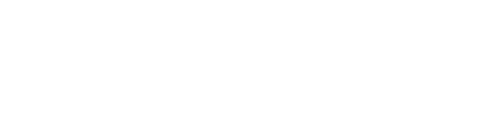
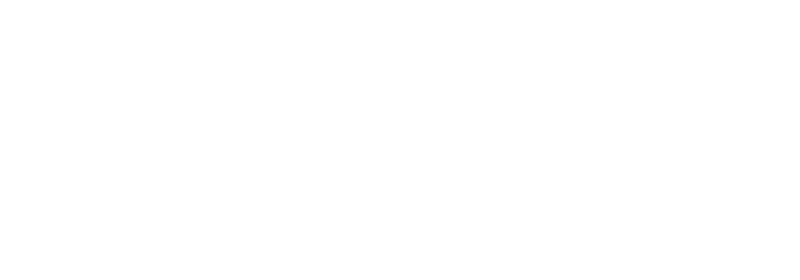

La cantidad de `variables dependientes` sera igual al **numero de equaciones**

### Caso $\mathbb{R}^{3} \to \mathbb{R}^{2}$

Dado un `sistema de funciones implicitas` y un punto $P_{0} = (x_{0}, y_{0}, z_{0})$

$$
\left\{
    \begin{array}{l}
        F(x, y, z) = 0
        \\\\
        G(x, y, z) = 0
    \end{array}
\right.
$$

Si se cumplen las condiciones del `teorema de la funcion implicita` 

- Tanto $F$ como $G$ evaludas en el punto $P_{0}$ son iguales a $0$

$$
    F(x_{0}, y_{0}, z_{0}) = 0
    \hspace{2em}
    G(x_{0}, y_{0}, z_{0}) = 0
$$

Entonces existen las `funciones`

$$
y = \mathbf{y}(x)
\hspace{1em}
z = \mathbf{z}(x)
$$

Tales que 

$$
y_{0} = \mathbf{y}(x_{0})
\hspace{1em}
z_{0} = \mathbf{z}(x_{0})
$$

$$
\begin{array}{c}
    
    F(x, \mathbf{y}(x), \mathbf{z}(x)) = 0
    \hspace{1em}
    \forall x \in \text{entorno de } P_{0}
    \\\\
    G(x, \mathbf{y}(x), \mathbf{z}(x)) = 0
    \hspace{1em}
    \forall x \in \text{entorno de } P_{0}
\end{array}
$$

 

y sus derivadas son:

### Derivadas

Expresando los `jacobianos` en **matrices** nos queda

