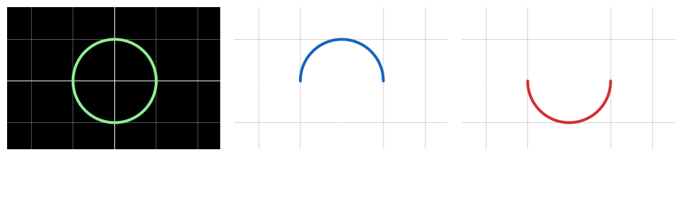
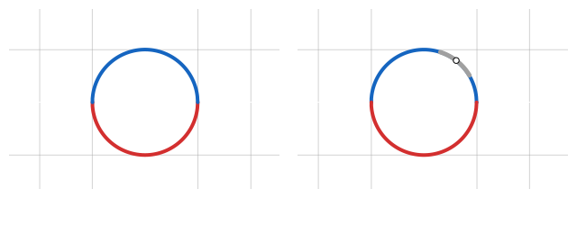

## Teorema de la funcion implicita - Cauchy / Dini

Permite convertir funciones definidas de manera implitica con muchas variables 

Dada una funcion implicita $F(x, y) = 0$

El teorema de la `funcion implicita` nos permite saber si existe una `funcion` $y = f(x)$ 

Que podemos remplazar en $F(x, f(x))$

Esta `funcion` $y = f(x)$ puede que no cubra todo el dominio y grafico de la `funcion implicita` $F(x, y)$

### Explicacion

Dada la `funcion implicita`

$$
    f(x, y): \hspace{1em} x^{2} + y^{2} = 1
$$

 

## Una sola ecuacion - Casos $\mathbb{R}^{n + 1} \to \mathbb{R}$

### Caso mas simple $\mathbb{R}^{2} \to \mathbb{R}$
> $n = 1\hspace{1em} m = 1$

Dada una `funcion` $F(x, y) = z$ y un **punto** $P_{0} = (x_{0}, y_{0})$

Si se cumple que

- $F$ evaluada en el **punto** $P_{0}$ es igual $0$ :
$\hspace{1em}F(x_{0}, y_{0}) = 0$

- $F$ es **continua** y **derivable**, al menos 1 vez, en el **entorno del punto** $P_{0}$

- La `derivada parcial` de $F$ con respecto a $y$ evaluada en el **punto** $P_{0}$ es distinta de $0$:
$\hspace{1em}F_{y}(x_{0}, y_{0}) \neq 0$

 

Para la `funcion implicita` $F(x, y) = 0$

Existe una `funcion` $y = f(x)$ en el **entorno del punto** $P_{0}$ tal que

$$
    y_{0} = f(x_{0})
    \hspace{2em}
    F(x, f(x)) = 0
    \hspace{1em}
    \forall x \in \text{entorno de } P_{0}
$$

 

### Caso $\mathbb{R}^{3} \to \mathbb{R}$
> $n = 2 \hspace{1em} m = 1$

Dada una `funcion` $F(x, y, z) = k$ y un **punto** $P_{0} = (x_{0}, y_{0}, z_{0})$

Si se cumple que

- $F$ evaluada en el **punto** $P_{0}$ es igual $0$ :
$\hspace{1em}F(x_{0}, y_{0}, z_{0}) = 0$

- $F$ es **continua** y **derivable**, al menos 1 vez, en el **entorno del punto** $P_{0}$

- La `derivada parcial` de $F$ con respecto a $z$ evaluada en el **punto** $P_{0}$ es distinta de $0$:
$\hspace{1em}F_{z}(x_{0}, y_{0}) \neq 0$

 

Para la `funcion implicita` $F(x, y, z) = 0$

Existe una `funcion` $z = f(x, y)$ en el **entorno del punto** $P_{0}$ tal que

$$
    z_{0} = f(x_{0}, y_{0})
    \hspace{2em}
    F(x, y, f(x, y)) = 0
    \hspace{1em} 
    \forall x \in \text{entorno de } P_{0}
$$

 

### Caso $\mathbb{R}^{3} \to \mathbb{R}^{2}$

Dada una `funcion` $F(x, y, z)$ y un **punto** $P_{0} = (x_{0}, y_{0}, z_{0})$

$$
F(x, y, z): \hspace{0.5em} \left\{
    \begin{array}{l}
        F_{1}(x, y, z)
        \\\\
        F_{2}(x, y, z)
    \end{array}
\right.
$$

$$
F(x, y, z): \hspace{0.5em} \left\{
    \begin{array}{l}
        \text{x}:\hspace{0.2em} G(x, y, z) = 0
        \\\\
        \text{y}:\hspace{0.2em} H(x, y, z) = 0
    \end{array}
\right.
F(x): \hspace{0.5em} \left\{
    \begin{array}{l}
        \text{x}:\hspace{0.2em} g(x) = 0
        \\\\
        \text{y}:\hspace{0.2em} h(x) = 0
    \end{array}
\right.
$$

---

$$
\left\{
    \begin{array}{l}
        F_{1}(x_{1}, \cdots, x_{n}, y_{1}, \cdots, y_{m}) = 0
        \\\\
        F_{2}(x_{1}, \cdots x_{n}, y_{1}, \cdots, y_{m}) = 0
        \\ \vdots \\
        F_{m}(x_{1}, \cdots, x_{n}, y_{1}, \cdots, y_{m}) = 0
    \end{array}
\right.
$$

$$

\left.\dfrac{d\mathbf{y}}{dx}\right|_{P_{0}} = - 
\dfrac{
    \dfrac{\partial(F, G)}{\partial(x, z)}
}{
    \dfrac{\partial(F, G)}{\partial(y, z)}
}
=
-
\dfrac{
\begin{vmatrix}
    F_{x}|_{P_{0}} & F_{z}|_{P_{0}}
    \\\\
    G_{x}|_{P_{0}} & G_{z}|_{P_{0}}
\end{vmatrix}
}{
\begin{vmatrix}
    F_{y}|_{P_{0}} & F_{z}|_{P_{0}}
    \\\\
    G_{y}|_{P_{0}} & G_{z}|_{P_{0}}
\end{vmatrix}
}
$$

> $\text{x} = x_{1}, \cdots, x_{n}$
>  
> $\text{y} = x_{1}, \cdots, y_{n}$