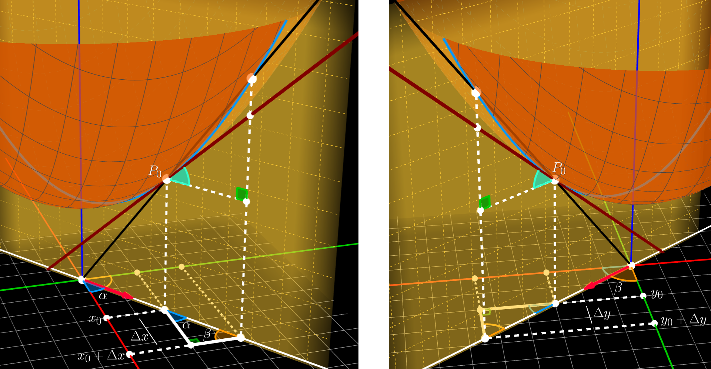
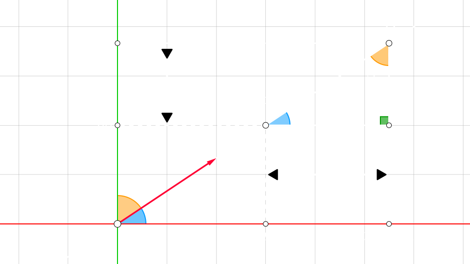
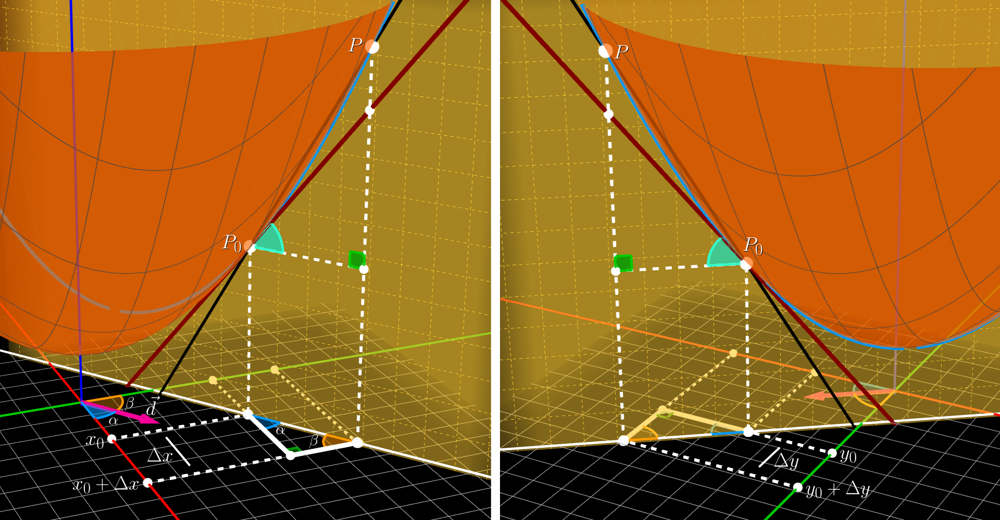
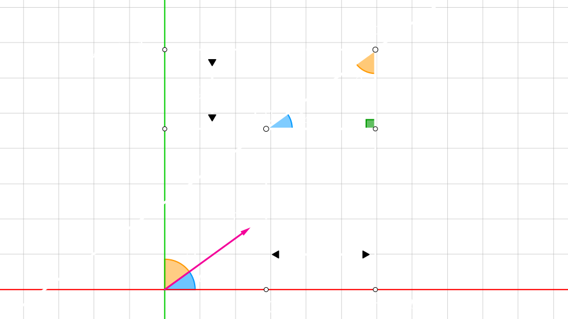

## Derivada direccional

Dada una **funcion** $f(x, y)$, un **punto** $P_{0} = (x_{0}, y{0})$ y un **punto incrementado** $P$ a una distancia $h$ de $P_{0}$ en una **direccion**

La derivada direccional se define como:

$$
\large{
    \lim_{P \to P_{0}} \dfrac{f(P) - f(P_{0})}{|P - P_{0}|} 
}
$$

<video src="./derivada-direccional-1.mp4" controls muted autoplay loop></video>

Que desarrollado es

$$
\large{
    \lim_{h \to 0} \dfrac{f(x_{0} + h \cdot \cos(\alpha), y_{0} + h \cdot \cos(\beta)) - f(x_{0}, y_{0})}{h} 
}
$$

> $\Delta x = h \cdot \cos(\alpha)$
>  
> $\Delta y = h \cdot \cos(\beta) = h \cdot \sin(\beta)$
>  
> $\alpha$ es el angulo entre el `eje x positivo` y la **direccion**
>  
> $\beta$ es el angulo entre el `eje y positivo` y la **direccion**

 

<video src="./derivada-direccional-2.mp4" controls muted autoplay loop></video>

$$
\large{
    P \rightarrow P_{0}
    \hspace{0.5em} \Longrightarrow \hspace{0.5em}
    h \rightarrow 0 
    \hspace{0.5em} \Longrightarrow \hspace{0.5em} 
    \left\{\begin{array}{l}
        \Delta x \rightarrow 0
        \\\\
        \Delta y \rightarrow 0
    \end{array}\right.
}
$$

  

$$
\large{
    D_{\vec{d}} f = \dfrac{\partial f}{\partial x} \cdot \cos(\alpha) + \dfrac{\partial f}{\partial y} \cdot \cos(\beta)
}
$$

 

### Derivada direccional con vector unitario

Dado una **funcion** $f(x, y)$ y un **vector direccion unitario** $\vec{d} = (a, b, 0)$

La derivada direccional de $f$ en la direccion $\vec{d}$ es

$$
\large{
    D_{\vec{d}} f = \dfrac{\partial f}{\partial x} \cdot a + \dfrac{\partial f}{\partial y} \cdot b
}
$$

 

## Vector gradiente

Dada una **funcion** $f(x, y)$ el `vector gradiente` es el **vector** formado por las `derivadas` parciales de $f$

$$
\large{
    \triangledown f(x, y) = \langle f_{x}(x, y), f_{y}(x, y) \rangle = \dfrac{\partial f}{\partial x} \cdot \hat{i} + \dfrac{\partial f}{\partial y} \cdot \hat{j}
}
$$

 

### Derivada direccional y el vector gradiente

Dada una **funcion** $f(x, y)$ y un **vector direccion unitario** $\vec{d} = (a, b)$

La derivada diriccional de $f$ en la direccion $\vec{d}$ es: 

*El **producto escalar** entre el `vector gradiente` de $f$ y el `vector direccion` $\vec{d}$*

$$
\large{
    D_{\vec{d}} f = \triangledown f(x, y) \bullet \vec{d}
}
$$

 

Si tomamos un punto $P_{0} = (x_{0}, y_{0})$ y  desarrollamos el producto escalar nos queda

$$
D_{\vec{d}} f|_{P_{0}} = \left.\dfrac{\partial f}{\partial x}\right|_{P_{0}} \cdot a + \left.\dfrac{\partial f}{\partial y}\right|_{P_{0}} \cdot b
$$

<video src="./derivada-direccional-3.mp4" controls muted autoplay loop></video>

  

#### Docs

- [Stewart calculo de varias variables - 14.6 - Derivadas direccionales y el vector gradiente](https://intranetua.uantof.cl/estudiomat/calculo3/stewart.pdf#page=330)