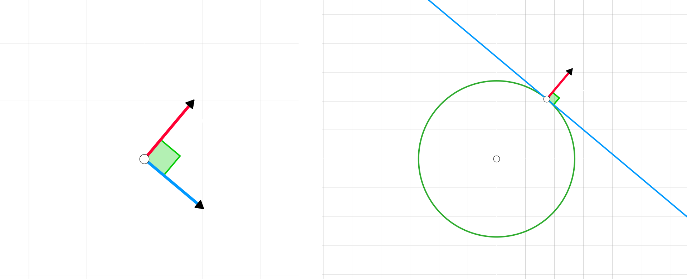

## Vector gradiente y las curvas de nivel

Dada un funcion $f(x, y)$ y un punto $P_{0} = (x_{0}, y_{0}, z_{0})$

El `vector gradiente` en $P_{0}$ es **normal** a la `curva de nivel` que pasa por $P_{0}$

La `curva de nivel` es la **curva** que obtenemos al intersectar la `superficie` definida por $f$ con el **plano** $z = z_{0}$

<video muted autoplay controls loop src="./gradiente-y-curvas-de-nivel.mp4"></video>

 

### Sobre el ejemplo

En el ejemplo usamos la **funcion** 

$$
    f(x, y) = x^{2} + y^{2} + c
$$

es un `paraboloide` y al tomar un punto $P_{0} = (x_{0}, y_{0}, z_{0})$

la `curva de nivel` que obtenemos al **intersectar** el `paraboloide` con un **plano** $z=z_{0}$

$$
    x^{2} + y^{2} + c = z_{0}
$$

son `circunferencias`

 

#### Derivada de la circunferencia

Aplicando el `teorema de la funcion implicita` sobre $f$ en el punto $P_{0}$ encontramos la `derivada` de esa `circunferencia` el punto $P_{0}$ como

$$
    -\dfrac{f_x(x_{0}, y_{0})}{f_y(x_{0}, y_{0})}
$$

donde $f_x(x_{0}, y_{0})$ y $f_y(x_{0}, y_{0})$ son presisamente las **componentes** del `vector gradiente`

 

#### Recta tangente y normal a la circunferencia

La ecuacion de la **recta normal** la obtenemos con el `vector gradiente`

$$
    r^{N}(t) = P_{0} + t \cdot \Big(f_x(x_{0}, y_{0}), f_y(x_{0}, y_{0}) \Big)
$$
 

y la ecucion de la **recta tangente** la obtenemos invirtiendo la **componentes** del `vector gradiente` y haciendo una de ellas negativa

$$
\begin{array}{c}
    r^{T}(t) = P_{0} + t \cdot \Big(-f_y(x_{0}, y_{0}), f_x(x_{0}, y_{0}) \Big)
    \\\\
    r^{T}(t) = P_{0} + t \cdot \Big(f_y(x_{0}, y_{0}), -f_x(x_{0}, y_{0}) \Big)
\end{array}
$$

  