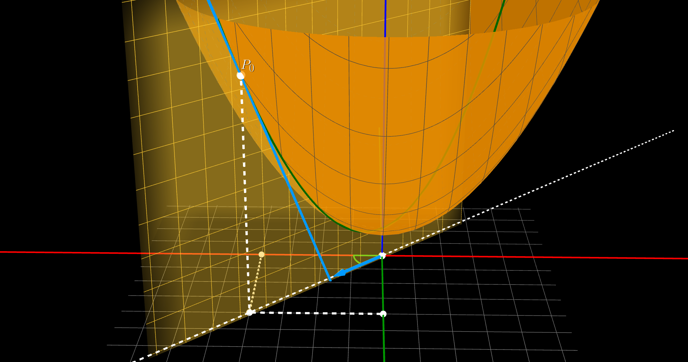
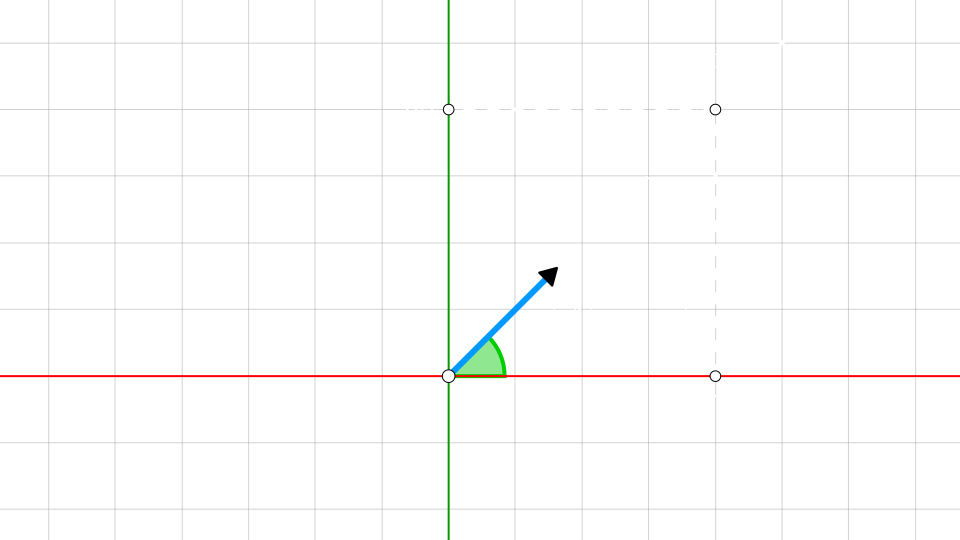
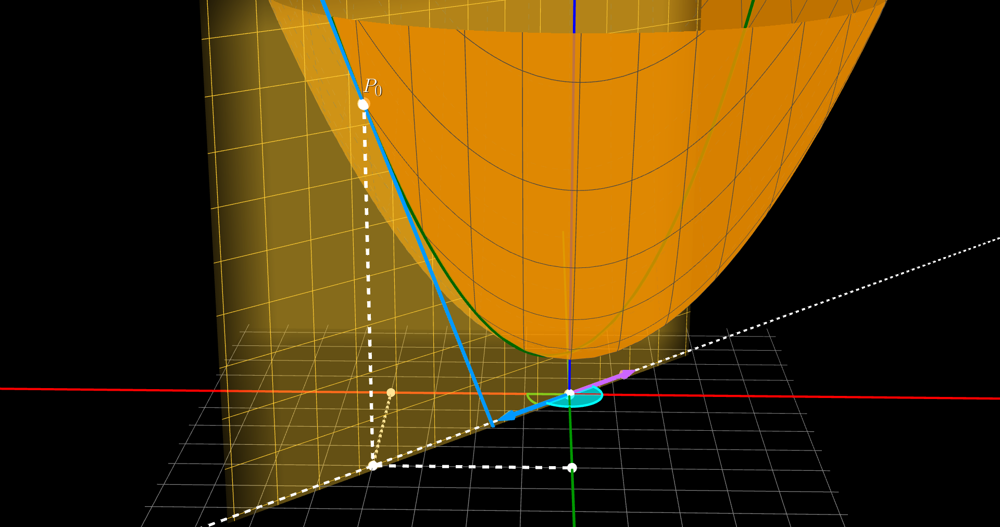
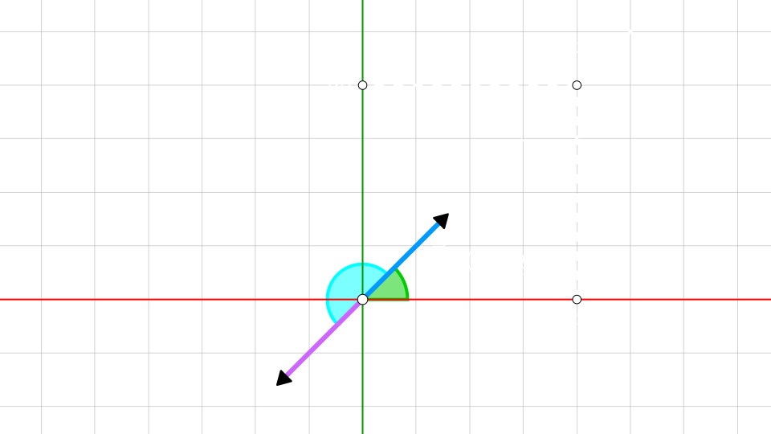
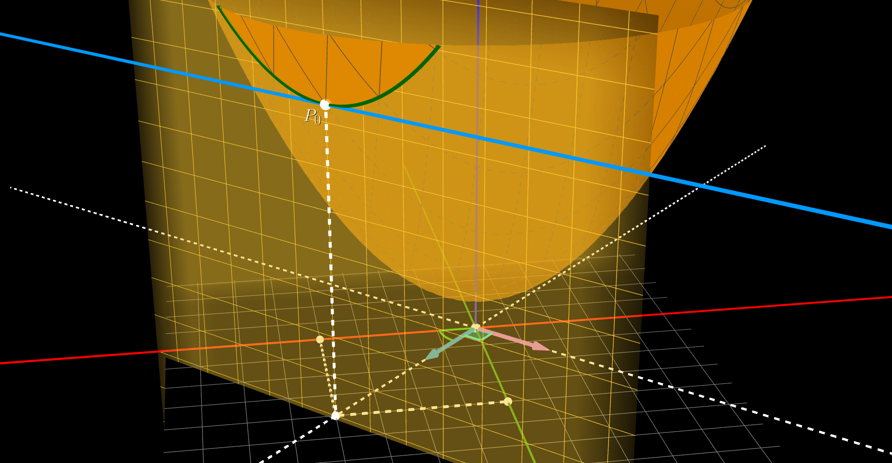
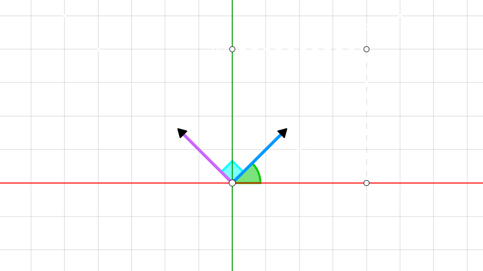

## Vector gradiente

Dada una **funcion** $f(x, y)$

Es el **vector** formado por las `derivadas parciales`

$$
\large{
    \vec{\triangledown} f(x, y) = \Big( f_{x}(x, y), f_{y}(x, y) \Big)  = \dfrac{\partial f}{\partial x} \cdot \mathbf{i} + \dfrac{\partial f}{\partial y} \cdot \mathbf{j} 
}
$$

el valor de sus **componentes** es el resultado de evaluar las `derivadas parciales` en un **punto** $P_{0} = (x_{0}, y_{0})$

$$
\vec{\triangledown} f(x_{0}, y_{0}) = \Big( f_{x}(x_{0}, y_{0}), f_{y}(x_{0}, y_{0}) \Big)  = \dfrac{\partial f}{\partial x}\Big|_{P_{0}} \cdot \mathbf{i} + \dfrac{\partial f}{\partial y}\Big|_{P_{0}} \cdot \mathbf{j}
$$

 

### Derivadas direccionales a partir del vector gradiente

A partir del `vector gradiente` en un **punto** $P_{0} = (x_{0}, y_{0})$ 

podemos calcular la `derivada direccional` sobre ese **punto** $P_{0}$ en **cualquier direccion**

usando el **modulo** del `vector gradiente` y el **angulo** que forma con la direccion

$$
\large{
    \dfrac{\partial f}{\partial\vec{d}}\Bigg|_{P_{0}} = \Big|\vec{\triangledown} f(x_{0}, 
    y_{0})\Big| \cdot \cos(\alpha)
}
$$

> $\alpha$ el **angulo** entre el `vector direccion` $\vec{d}$ y el `vector gradiente`

 

### Maximo

<video src="./maxima-3d.mp4" loop muted autoplay controls></video>
 

### Minimo

<video src="./minima-3d.mp4" loop muted autoplay controls></video>
 

### Cero

<video src="./cero-3d.mp4" loop muted autoplay controls></video>
 

