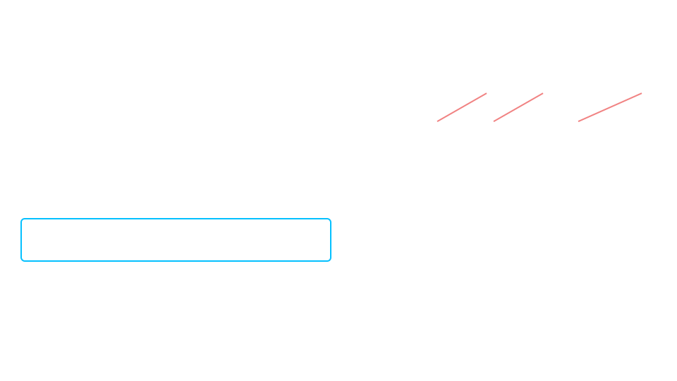
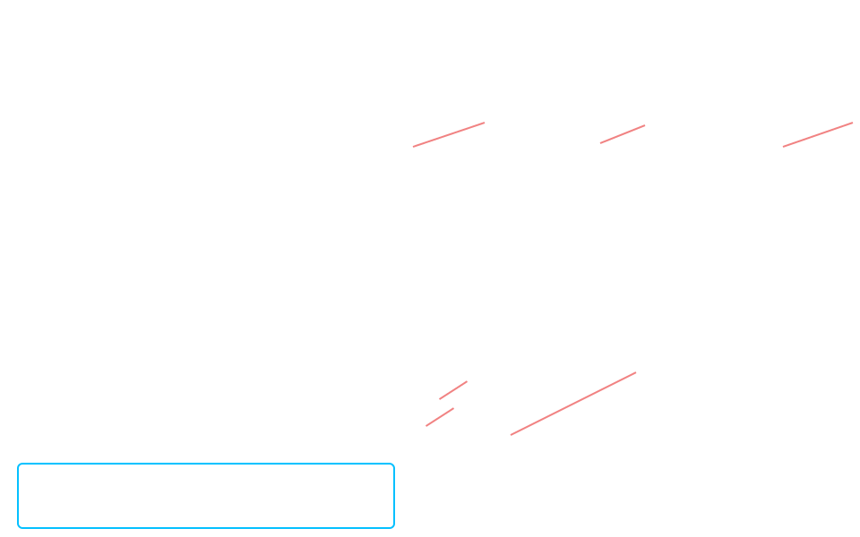
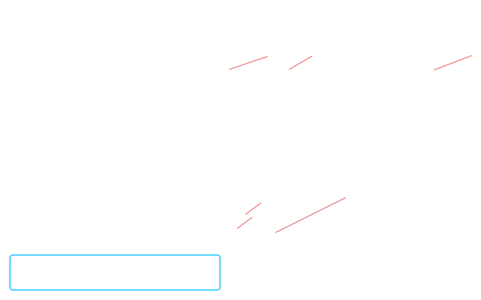
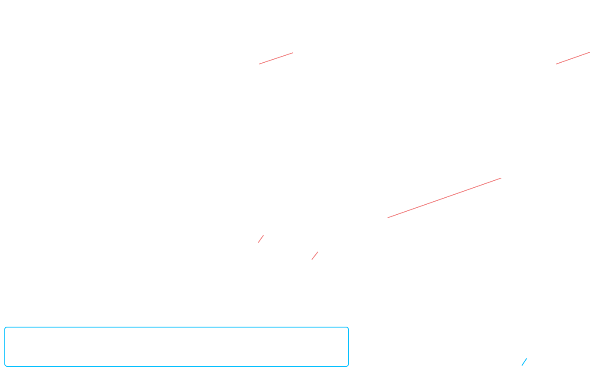

## Demostraciones propiedades de un funcion diferenciable en 3D

Dada una `funcion diferenciable` $z = f(x, y)$

y un punto $P_{0} = (x_{0}, y_{0})$

#### Definicion de funcion diferenciable

Por la definicion de `funcion diferenciable` tenemos que

$$
f(x_{0} + \Delta x, y_{0} + \Delta y) = f(x_{0}, y_{0}) + A \cdot \Delta x + B \cdot \Delta y + r(\Delta x, \Delta y)
$$

con 

$$
\lim_{(\Delta x, \Delta y) \to (0, 0)} \dfrac{r(\Delta x, \Delta y)}{\sqrt{\displaystyle{\Delta x^{2} + \Delta y^{2}}}} = 0
$$

Utilizando esta definicion vamos a probar `continuidad`, existencia de `derivadas parciales` y `direccionales`

remplazando el **punto incrementado**

 

### Continuidad

Para demostrar la `continuidad` planteamos este limite 

$$
\lim_{(\Delta x, \Delta y) \to (0, 0)} f(x_{0} + \Delta x, y_{0} + \Delta y) = f(x_{0}, y_{0})
$$

que es equivalente al de la definicion de `continuidad`

$$
\lim_{(x, y) \to (x_{0}, y_{0})} f(x, y) = f(x_{0}, y_{0})
$$

 

remplazando $f(x_{0} + \Delta x, y_{0} + \Delta y)$ por la definicion de `funcion diferenciable`

resolviendo el limite nos queda

Si la **funcion** es `diferenciable` en un **punto**, entonces es `continua` en ese **punto**

 

### Derivadas parciales

- #### Derivada parcial con respecto a $x$

    Tomamos la definicion de `derivada parcial` con respecto a $x$

    $$
    \lim_{\Delta x \to 0} \dfrac{f(x_{0} + \Delta x, y_{0})-f(x_{0}, y_{0})}{\Delta x}
    $$

    y remplazamos $f(x_{0} + \Delta x, y_{0})$ por la definicion de `funcion diferenciable`

    resolviendo el limite nos queda

    

    La `derivada parcial` con respecto a $x$ existe y es igual al coefeficiente $A$

 

- #### Derivada parcial con respecto a $y$

    Tomamos la definicion de `derivada parcial` con respecto a $y$

    $$
    \lim_{\Delta y \to 0} \dfrac{f(x_{0}, y_{0} + \Delta y)-f(x_{0}, y_{0})}{\Delta x}
    $$

    y remplazamos $f(x_{0}, y_{0} + \Delta y)$ por la definicion de `funcion diferenciable`

    resolviendo el limite nos queda

    

    La `derivada parcial` con respecto a $y$ existe y es igual al coefeficiente $B$

 

### Derivadas direccionales

Tomamos la deficion de `derivada direccional`

Dada una **direccion** $\vec{d} = \big(\cos(\alpha), \sin(\alpha)\big)$ con $\alpha$ siendo el **angulo** con el **eje x** positivo, la `derivada direccional` es

$$
\lim_{h \to 0} \dfrac{f(x_{0} + h \cdot \cos(\alpha), y_{0} + h \cdot \sin(\alpha)) - f(x_{0}, y_{0})}{h}
$$

donde $h$ es la distancia entre el **punto** y el **punto incrementado**

$$
    h = \sqrt{\displaystyle{\Delta x^{2} + \Delta y^{2}}}
$$

$$
\Delta x = h \cdot \cos(\alpha)
\hspace{2em}
\Delta y = h \cdot \sin(\alpha)
$$

 

remplazamos $f(x_{0} + h \cdot \cos(\alpha), y_{0} + h \cdot \sin(\alpha))$ por la definicion de `funcion diferenciable`

resolviendo el limite nos queda 

Existen las `derivada direccionales` en cualquier direccion $\vec{d} = \big(\cos(\alpha), \sin(\alpha)\big)$ y se puden calcular con los coeficientes $A$ y $B$

que como probamos anteriormente son las `derivadas parciales` con respecto a $x$ e $y$

