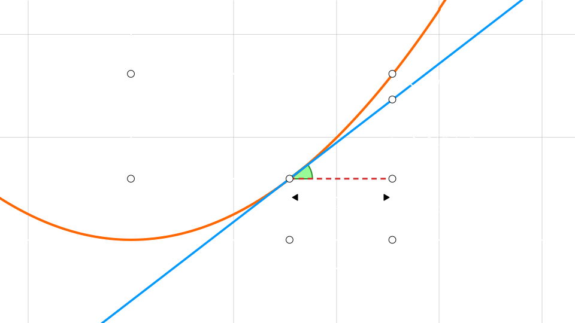

## Funcion diferenciable - Plano 2D 
> Caso $\mathbb{R} \to \mathbb{R}$

  

$$
f(x_{0} + h) = f(x_{0}) + f'(x_{0}) \cdot h + r(h)
$$

$$
\lim_{h \to 0} \dfrac{r(h)}{h} = 0
$$
$r(h)$ tiende a $0$ mucho **mas rapido** que $h$

 

> La **funcion evaluada en el punto** mas algo **lineal** y el **incremento**