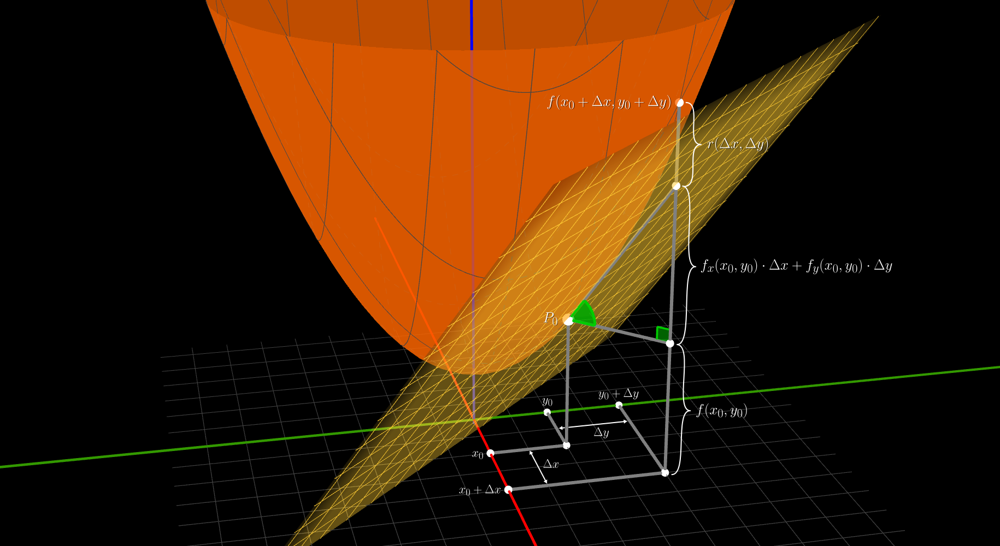

## Funcion diferenciable - 3D
> Caso $\mathbb{R}^{2} \to \mathbb{R}$

 

Una **funcion** $f(x, y)$ es `diferenciable` en un **punto** $P_{0} = (x_{0}, y_{0})$

Si existen los **coeficientes** $A$ y $B$ tal que

$$
\large{
    f(x_{0} + \Delta x, y_{0} + \Delta y) = f(x_{0}, y_{0}) + A \cdot \Delta x + B \cdot \Delta y  + r(\Delta x, \Delta y)
}
$$

> $f(x_{0}, y_{0})$ la funcion evaluada en el **punto**
>   
> $f(x_{0} + \Delta x, y_{0} + \Delta y)$ la funcion evaluada en el **punto incrementado**
>   
> $A$ y $B$ son los **coeficientes** de la `transformacion lineal` que plantea la definicion general
>   
> $r(\Delta x, \Delta y)$ es el **resto**

 

### Interpretacion geometrica en el espacio 3D

### El resto $r$

Es lo que falta para igualar el cambio $\Delta y$

$$
\Delta y =  f(x_{0} + \Delta x, y_{0} + \Delta y) - f(x_{0}, y_{0})
$$

$$
\Delta y \approx A \cdot \Delta x + B \cdot \Delta y    
\hspace{1.5em}
\Delta y = A \cdot \Delta x + B \cdot \Delta y + r(\Delta x, \Delta y) 
$$

$r(\Delta x, \Delta y)$  cumple con la propiedad de que tiende a $0$ **mucho mas rapido** el modulo del **incremento**

$$
\lim_{(\Delta x, \Delta y)\to(0, 0)}
\dfrac{r(\Delta x, \Delta y)}{
    \sqrt{\displaystyle{\Delta x^{2} + \Delta y^{2}}}
} = 0
$$
 

si despejamos $r(\Delta x, \Delta y)$ y remplazamos nos queda el limite

$$
\lim_{(\Delta x, \Delta y)\to(0, 0)} \dfrac{f(x_{0} + \Delta x, y_{0} + \Delta y) - f(x_{0}, y_{0}) - A \cdot \Delta x - B \cdot \Delta y}
{\sqrt{\displaystyle{\Delta x^{2} + \Delta y^{2}}}} = 0
$$

este limite es el **nucleo** de la definicion de `funcion diferenciable` ya que su existencia determina si una **funcion** es `diferenciable` o no

y los unicos valores posibles para los **coeficientes** $A$ y $B$ que hacen cumplir este limite son

las `derivadas parciales` de $f$ en $P_{0}$

$$
    A = f_{x}(x_{0}, y_{0})
    \hspace{2em}
    B = f_{y}(x_{0}, y_{0})
$$

reemplazando en el limite nos queda

$$
\lim_{(\Delta x, \Delta y)\to(0, 0)} \dfrac{f(x_{0} + \Delta x, y_{0} + \Delta y) - f(x_{0}, y_{0}) - f_{x}(x_{0}, y_{0}) \cdot \Delta x - f_{y}(x_{0}, y_{0}) \cdot \Delta y}
{\sqrt{\displaystyle{\Delta x^{2} + \Delta y^{2}}}} = 0
$$

 

### Plano Tangente

Tomamos el limite anterior 

$$
\lim_{(\Delta x, \Delta y)\to(0, 0)} \dfrac{f(x_{0} + \Delta x, y_{0} + \Delta y) - f(x_{0}, y_{0}) - f_{x}(x_{0}, y_{0}) \cdot \Delta x - f_{y}(x_{0}, y_{0}) \cdot \Delta y}
{\sqrt{\displaystyle{\Delta x^{2} + \Delta y^{2}}}} = 0
$$

y lo reescribimos con el cambio de variable

$$
    \Delta x = x - x_{0}
    \hspace{2em}
    \Delta y = y - y_{0}
$$
 

$$
\lim_{(x, y)\to(x_{0}, y_{0})} \dfrac{f(x, y) - f(x_{0}, y_{0}) - f_{x}(x_{0}, y_{0}) \cdot (x - x_{0}) - f_{y}(x_{0}, y_{0}) \cdot (y - y_{0})}
{\sqrt{\displaystyle{(x - x_{0})^{2} + (y - y_{0})^{2}}}} = 0
$$

reordenando nos queda

$$
\lim_{(x, y)\to(x_{0}, y_{0})} \dfrac{f(x, y) - \Big( f(x_{0}, y_{0}) + f_{x}(x_{0}, y_{0}) \cdot (x - x_{0}) + f_{y}(x_{0}, y_{0}) \cdot (y - y_{0}) \Big)}
{\sqrt{\displaystyle{(x - x_{0})^{2} + (y - y_{0})^{2}}}} = 0
$$
 

finalmente si tomamos la expresion entre parentesis y la igualamos a $z$ obtenemos la **ecuacion** del `plano tangente` a $f$ en el punto $P_{0}$

$$
    z = f(x_{0}, y_{0}) + f_{x}(x_{0}, y_{0}) \cdot (x - x_{0}) + f_{y}(x_{0}, y_{0}) \cdot (y - y_{0})
$$

 

<video src="./funcion-diferenciable-3d.mp4" loop autoplay muted controls></video>

 

> #### Relacion con el `Polinomio de taylor`