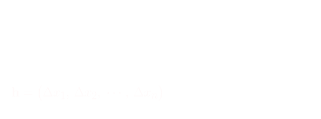

## Funcion diferenciable - Definicion general
> Caso general $\mathbb{R}^{n} \to \mathbb{R}^{m}$

 

Dada un **funcion** 

$$
\mathbf{y} = f(\mathbf{x}) 
\hspace{2em}
\begin{array}{c}
    \mathbf{x} = \begin{pmatrix}
        x_{1}, x_{2}, \cdots, x_{n}
    \end{pmatrix}
    \\\\
    \mathbf{y} = \begin{pmatrix}
        y_{1}, y_{2}, \cdots, y_{m}
    \end{pmatrix}
\end{array}
$$

y un **punto** $\mathbf{a} = \begin{pmatrix}a_{1}, a_{2}, \cdots, a_{n}\end{pmatrix}$

La funcion $f$ es `diferenciable` en el punto $\mathbf{a}$ si

existe una `transformacion lineal` de $\mathbb{R}^{n} \to \mathbb{R}^{m}$ que evaluada en $\mathbf{h}$

$T(\mathbf{a})$ es una `transformacion lineal` en el **punto** $\mathbf{a}$

En **2D** seria una **recta**, la `recta tangente`

En **3D** seria un **plano**, el `plano tangente`
