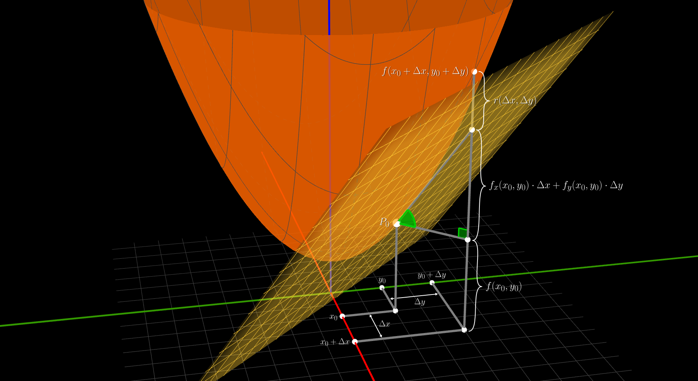

## Funcion diferenciable - 3D

Caso $\mathbb{R}^{2} \to \mathbb{R}$

Una **funcion** $f(x, y)$ es `diferenciable` en un **punto** $P_{0} = (x_{0}, y_{0}, z_{0})$

si existen $A$ y $B$ tal que

$$
\large{
    f(x_{0} + \Delta x, y_{0} + \Delta y) = f(x_{0}, y_{0}) + A \cdot \Delta x + B \cdot \Delta y  + r(h)
}
$$

 

#### Transformacion lineal

$A$ y $B$ son los **coeficientes** de la `transformacion lineal`

y los unicos valores posibles que hacen cumplir lo anterior son

$$
A = f_{x}(x_{0}, y_{0})
\hspace{2em}
B = f_{y}(x_{0}, y_{0})
$$

$A$ y $B$ son las `derivadas parciales` de $f$ en $P_{0}$

y $f(x_{0}, y_{0}) + A \cdot \Delta x + B \cdot \Delta y$ es un **punto** en el `plano tangente` a la funcion $f$ en $P_{0}$

 

#### Incremeto $r$
$$
\lim_{(\Delta x, \Delta y)\to(0, 0)}
\dfrac{r(\Delta x, \Delta y)}{
    \sqrt{\displaystyle{\Delta x^{2} + \Delta y^{2}}}
} = 0
$$

$r(\Delta x, \Delta y)$ tiende a $0$ mucho mas **rapido** que el `modulo` de $\Delta x, \Delta y$

 

#### Remplazando nos queda

$$
\large{
    f(x_{0} + \Delta x, y_{0} + \Delta y) = f(x_{0}, y_{0}) + f_{x}(x_{0}, y_{0}) \cdot \Delta x + f_{y}(x_{0}, y_{0})\cdot \Delta y  + r(h)
}
$$

> Es el `polinimio de Taylor` de grado 1

  

<video src="./funcion-diferenciable-3d.mp4" loop autoplay muted controls></video>