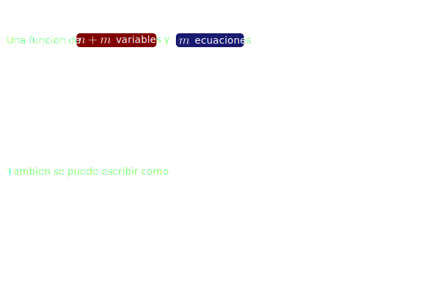
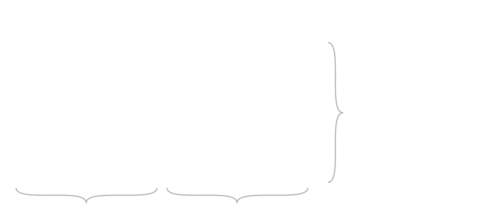

## Teorema de la funcion implicita - General 

La `matriz jacobiana` de la **funcion** es

La **matriz** cuadrada $Y$ de orden $m \times m$ tiene que tener `inversa` por lo que su `determinante` debe ser distinto de $0$

  

#### Docs

- [Funciones implícitas](https://www.youtube.com/watch?v=RgfQCra8yOs)
- [The implicit function theorem](https://www.youtube.com/watch?v=bk9IKHS5KbY)
- [The implicit function theorem - continued
](https://www.youtube.com/watch?v=QjpIGJm6TLQ)
- [The implicit function theorem for systems of equations](https://www.youtube.com/watch?v=B-lreG2iuG0)
- [Implicit function theorem](https://en.wikipedia.org/wiki/Implicit_function_theorem)
- [Teorema Función Implícita](https://www.youtube.com/watch?v=QjFxuH2ubO4)