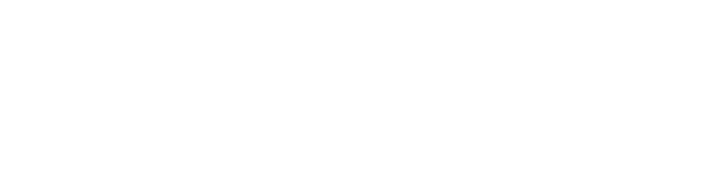

## Sistema de funciones implicitas - ejemplo 1

Dada la **curva**

$$
\left\{
    \begin{array}{l}
        F(x, y, z): \hspace{1em} 3 \cdot x + y^2 - z + 3 = 0
        \\\\
        G(x, y, z): \hspace{1em} 3 \cdot x + \dfrac{y}{2} + 4 \cdot z = 0
    \end{array}
\right.
$$

<video src="ejemplo-1.mp4" loop autoplay muted controls></video>

encontrar la `recta tangente`

  

1. ### Probar el `teorema de la funcion implicita`

    #### Derivadas parciales de $F$

    $$
        \dfrac{\partial F}{\partial x} = 3
        \hspace{2em}
        \dfrac{\partial F}{\partial y} = 2 \cdot y
        \hspace{2em}
        \dfrac{\partial F}{\partial z} = -1
    $$

    #### Derivadas parciales de $F_{2}$

    $$
        \dfrac{\partial G}{\partial x} = 3
        \hspace{2em}
        \dfrac{\partial G}{\partial y} = 1
        \hspace{2em}
        \dfrac{\partial G}{\partial z} = 4
    $$

     

    #### Calcular el jacobiano

    $$
    \dfrac{\partial(F_1, F_2)}{\partial(y, z)} = \begin{vmatrix}
        F_{y} & F_{z} \\ G_{y} & G_{z}
    \end{vmatrix} 
    $$

    Remplazando nos queda
    $$
        \dfrac{\partial(F, G)}{\partial(y, z)} = \begin{vmatrix}
            2 \cdot y & -1
            \\
            1 & 4
        \end{vmatrix}
        = (2 \cdot y \cdot 4) - (-1 \cdot 1)
    $$

    $$
        \dfrac{\partial(F_1, F_2)}{\partial(y, z)} = 8 \cdot y + 1
    $$

     

    Se cumple el `teorema de la funcion implicita`

    existen 2 **funciones** $y = f(x)$ y $z = g(x)$ que 

    $$
    \left\{
        \begin{array}{l}
            F(x, f(x), g(x)) = 0
            \\\\
            G(x, f(x), g(x)) = 0
        \end{array}
    \right.
    $$

    por lo que podemos reescribir la `curva interseccion` en funcion de $x$

    $$
    \left\{
        \begin{array}{l}
            x = x
            \\\\
            y = f(x)
            \\\\
            z = g(x)
        \end{array}
    \right.
    \hspace{3em}
    c(t) = 
    \left\{
        \begin{array}{l}
            x = t
            \\\\
            y = f(t)
            \\\\
            z = g(t)
        \end{array}
    \right.
    $$
 

2. ### Encontrar la derivada

    Si bien no conocemos la forma a las **funciones** $f$ y $g$

    el `teorema de la funcion implicita` nos asegura que **existen** y sus derivadas en un punto $P = (x, y,z)$ son

    

    desarrollando nos queda

    $$
    \begin{array}{l}
        f'(x) : m_{1}(x, y, z) = 
        - \dfrac{
            \begin{vmatrix}
                3 & -1
                \\
                3 & 4
            \end{vmatrix}
        }{8 \cdot y + 1}
        = - \dfrac{12 + 3}{8 \cdot y + 1}
        = - \dfrac{15}{8 \cdot y + 1}
        \\\\
        g'(x): m_{2}(x, y, z) = 
        - \dfrac{
            \begin{vmatrix}
                2 \cdot y & 3
                \\
                1 & 3
            \end{vmatrix}
        }{8 \cdot y + 1}
        = - \dfrac{6 \cdot y - 3}{8 \cdot y + 1}
    \end{array}
    $$
 

3. ### La recta tangente

    Finalmente la ecuacion de `recta tangente` a un punto $P_{0} = (x_{0}, y_{0}, z_{0})$ de la **curva** es

    $$
    r(t) = \left\{
        \begin{array}{l}
            x = x_{0} + t
            \\\\
            y = y_{0} + t \cdot m_{1}(x_{0}, y_{0}, z_{0})
            \\\\
            z = z_{0} + t \cdot m_{2}(x_{0}, y_{0}, z_{0})
        \end{array}
    \right.

    \hspace{2em}
    \dfrac{x - x_{0}}{1}
    = \dfrac{y - y_{0}}{m_{1}|_{P_{0}}}
    = \dfrac{z - z_{0}}{m_{2}|_{P_{0}}}
    $$

<video src="ejemplo-1.1.mp4" loop autoplay muted controls></video>