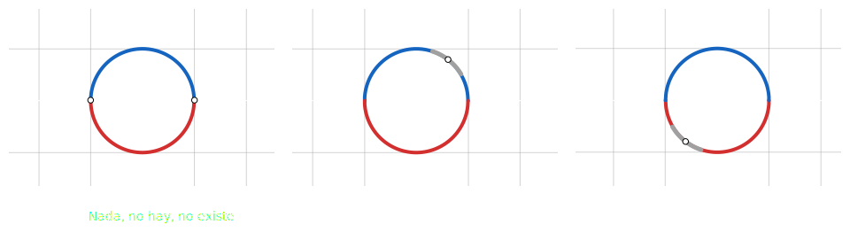

## Teorema de la funcion implicita - Cauchy / Dini

### Descripcion

Nos permite reescribir **funciones implicitas**  implitica con muchas variables

Dada una funcion implicita $F(x, y) = 0$

El teorema de la `funcion implicita` nos permite saber si existe una `funcion` $y = f(x)$ 

Que podemos remplazar en $F(x, f(x))$

Esta `funcion` $y = f(x)$ puede que no cubra todo el dominio y grafico de la `funcion implicita` $F(x, y)$

### Explicacion

Dada la `funcion implicita`

$$
    f(x, y): \hspace{1em} x^{2} + y^{2} = 1
$$

 

## Una sola ecuacion - Casos $\mathbb{R}^{n + 1} \to \mathbb{R}$

### Caso mas simple $\mathbb{R}^{2} \to \mathbb{R}$
> $n = 1\hspace{1em} m = 1$

Dada una `funcion` $F(x, y) = z$ y un **punto** $P_{0} = (x_{0}, y_{0})$

Si se cumple que

- $F$ evaluada en el **punto** $P_{0}$ es igual $0$ :
$\hspace{1em}F(x_{0}, y_{0}) = 0$

- $F$ es **continua** y **derivable**, al menos 1 vez, en el **entorno del punto** $P_{0}$

- La `derivada parcial` de $F$ con respecto a $y$ evaluada en el **punto** $P_{0}$ es distinta de $0$:
$\hspace{1em}F_{y}(x_{0}, y_{0}) \neq 0$

 

Para la `funcion implicita` $F(x, y) = 0$

Existe una `funcion` $y = f(x)$ en el **entorno del punto** $P_{0}$ tal que

$$
    y_{0} = f(x_{0})
    \hspace{2em}
    F(x, f(x)) = 0
    \hspace{1em}
    \forall x \in \text{entorno de } P_{0}
$$

 

### Caso $\mathbb{R}^{3} \to \mathbb{R}$
> $n = 2 \hspace{1em} m = 1$

Dada una `funcion` $F(x, y, z) = k$ y un **punto** $P_{0} = (x_{0}, y_{0}, z_{0})$

Si se cumple que

- $F$ evaluada en el **punto** $P_{0}$ es igual $0$ :
$\hspace{1em}F(x_{0}, y_{0}, z_{0}) = 0$

- $F$ es **continua** y **derivable**, al menos 1 vez, en el **entorno del punto** $P_{0}$

- La `derivada parcial` de $F$ con respecto a $z$ evaluada en el **punto** $P_{0}$ es distinta de $0$:
$\hspace{1em}F_{z}(x_{0}, y_{0}) \neq 0$

 

Para la `funcion implicita` $F(x, y, z) = 0$

Existe una `funcion` $z = f(x, y)$ en el **entorno del punto** $P_{0}$ tal que

$$
    z_{0} = f(x_{0}, y_{0})
    \hspace{2em}
    F(x, y, f(x, y)) = 0
    \hspace{1em} 
    \forall x \in \text{entorno de } P_{0}
$$

 

## 2 ecuaciones - Caso $\mathbb{R}^{3} \to \mathbb{R}^{2}$

Dada una `funcion` $Q(x, y, z)$ definida mediante un **sistema de 2 ecuaciones** y un **punto** $P_{0} = (x_{0}, y_{0}, z_{0})$

$$
Q(x, y, z): \hspace{0.5em} \left\{
    \begin{array}{l}
        F(x, y, z)
        \\\\
        G(x, y, z)
    \end{array}
\right.
$$

Si se cumple que 

- $F$ y $G$ evaluadas en el **punto** $P_{0}$ son $0$ :

$$
F(x_{0}, y_{0}, z_{0}) = 0
\hspace{1em}
G(x_{0}, y_{0}, z_{0}) = 0
$$

- $F$ es **continua** y **derivable**, al menos 1 vez, en el **entorno del punto** $P_{0}$

- El `determinante jacobiano` de $F$ y $G$ con respecto a $y$ y $z$ evaluado en el **punto** $P_{0}$ es distinto de $0$:
  
$$
\left.
    \dfrac{\partial(F, G)}{\partial(y, z)}
\right|_{P_{0}}
= \begin{vmatrix}
    F_{y}|_{P_{0}} & F_{z}|_{P_{0}}
    \\\\
    G_{y}|_{P_{0}} & G_{z}|_{P_{0}}
\end{vmatrix}
\neq 0
$$

 

Para las `funciones implicitas` $F$ y $G$
$$
\hspace{0.5em} \left\{
    \begin{array}{l}
        F(x, y, z) = 0
        \\\\
        G(x, y, z) = 0
    \end{array}
\right.
$$

Existen 2 **funciones** $y = \mathbf{y}(x)$ y $z = \mathbf{z(x)}$ tal que

$$
y_{0} = \mathbf{y}(x_{0})
\hspace{3em}
z_{0} = \mathbf{z}(x_{0})
$$

$$
\hspace{0.5em} \left\{
    \begin{array}{l}
        F(x, \mathbf{y}(x), \mathbf{z}(x)) = 0
        \\\\
        G(x, \mathbf{y}(x), \mathbf{z}(x)) = 0
    \end{array}
\right.
\hspace{2em}
\forall x \in \text{entorno de } P_{0}
$$ 
 

Por lo que se puede **reescribir la funcion** $Q(x, y, z)$ para el entorno del punto $P_{0}$ como

$$
    q(x) = \left\{
        \begin{array}{l}
            x = x
            \\\\
            y = \mathbf{y}(x)
            \\\\
            z = \mathbf{z}(x)
        \end{array}
    \right.
$$

  

#### Docs

- [Funciones implícitas](https://www.youtube.com/watch?v=RgfQCra8yOs)
- [The implicit function theorem](https://www.youtube.com/watch?v=bk9IKHS5KbY)
- [The implicit function theorem - continued
](https://www.youtube.com/watch?v=QjpIGJm6TLQ)
- [The implicit function theorem for systems of equations](https://www.youtube.com/watch?v=B-lreG2iuG0)
- [Implicit function theorem](https://en.wikipedia.org/wiki/Implicit_function_theorem)
- [Teorema Función Implícita](https://www.youtube.com/watch?v=QjFxuH2ubO4)

