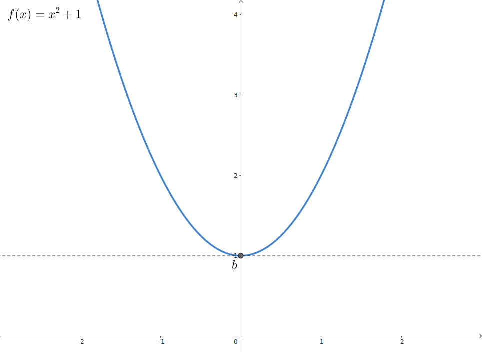

# Funcion acotada

Una funcion esta `acotada` cuando su `rango` es distinto de $(-\infty, \infty)$

 

## Funcion acotada superiormente

Dada una **funcion** $f(x)$ existe un numero real $a$ que cumple que:

$$
    f(x) \leq a \hspace{2em} \forall x \in \text{Dom}(f)
$$
 

> El rango de $f$ es: $(-\infty, a)$ o $(-\infty, a]$ 

> $a$ es una `cota superior` de la **funcion**

#### Ejemplos: 

$$
    \begin{array}{c}
        \large{f(x) = -x^{2} - 1}
        \\\\
        \text{Dom}(f) = \mathbb{R} 
        \hspace{2em}
        \text{Rng}(f) = (-\infty, -1] 
    \end{array}
$$

 

## Funcion acotada inferiormente

Dada una **funcion** $f(x)$ existe un numero real $b$ que cumple que:

$$
    f(x) \geq b \hspace{2em} \forall x \in \text{Dom}(f)
$$
 

> El rango de $f$ es: $(b, \infty)$ o $[b, \infty)$ 

> $b$ es una `cota inferior` de la **funcion**

#### Ejemplos: 

$$
    \begin{array}{c}
        \large{f(x) = x^{2} + 1}
        \\\\
        \text{Dom}(f) = \mathbb{R} 
        \hspace{2em}
        \text{Rng}(f) = [1, \infin] 
    \end{array}
$$

 

## Funcion acotada superiormente e inferiormente

Dada una **funcion** $f(x)$ existen 2 numeros reales $a$ y $b$ que cumplen que:

$$
    a \geq f(x) \leq b \hspace{2em} \forall x \in \text{Dom}(f)
$$
 

> El rango de $f$ es: 
> - $(a, b)$
> - $[a, b]$
> - $(a, b]$
> - $[a, b)$  

> $a$ es una `cota inferior` y $b$ es una `cota superior` de la **funcion**

#### Ejemplos: 

$$
    \begin{array}{c}
        \large{f(x) =\tanh(x)}
        \\\\
        \text{Dom}(f) = \mathbb{R} 
        \hspace{2em}
        \text{Rng}(f) = [-1, 1] 
    \end{array}
$$

