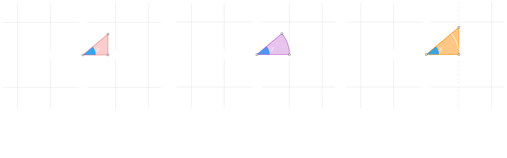
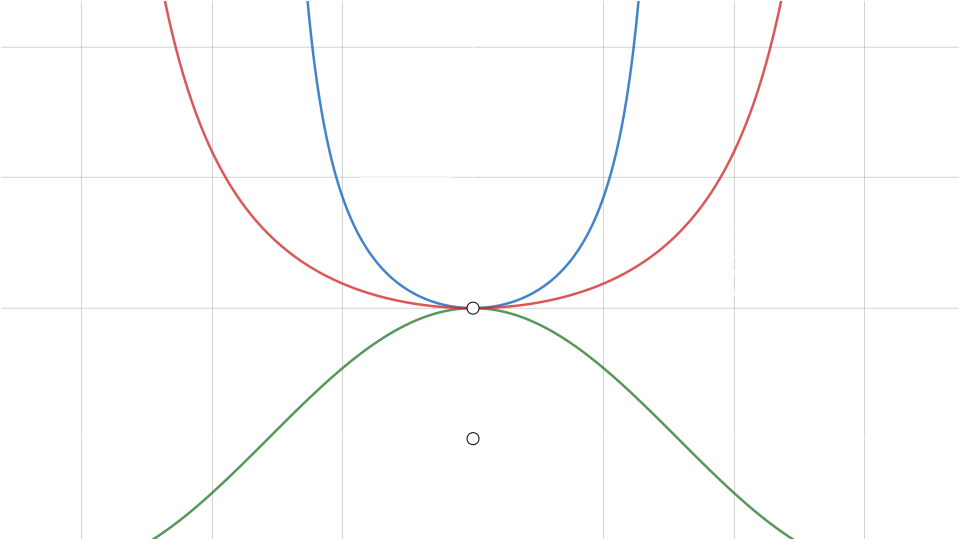
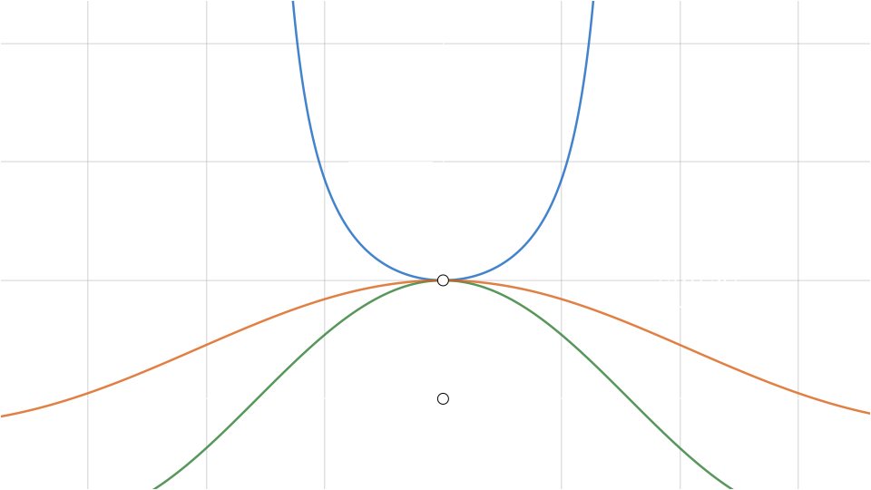

## Limite Trigonometrico fundamental

$$
    \lim_{x \to 0} \frac{\sin(x)}{x} = 1
    \hspace{3em}
    \lim_{x \to 0} \frac{k \cdot \sin(x)}{k \cdot x} = 1
$$

Tambien aplica al reves

$$
    \lim_{x \to 0} \frac{x}{\sin(x)} = 1
    \hspace{3em}
    \lim_{x \to 0} \frac{k \cdot x}{k \cdot \sin(x)} = 1
$$

 

## Demostracion

Calculamos las areas en **funcion del angulo** $x$

$$
    \frac{\cos(x) \cdot \sin(x)}{2} \leq \frac{x}{2} \leq \frac{\tan(x)}{2}
$$

Multiplicamos todo por $2$

$$
\begin{array}{c}
    \displaystyle{
        \frac{\cancel{2} \cdot \cos(x) \cdot \sin(x)}{\cancel{2}}
        \leq
        \frac{\cancel{2} \cdot x}{\cancel{2}}
        \leq
        \frac{\cancel{2} \cdot \tan(x)}{\cancel{2}}
    }
    \\\\
    \displaystyle{
        \cos(x) \cdot \sin(x)
        \leq
        x
        \leq
        \tan(x)
    }
    \\\\
    \displaystyle{
        \cos(x) \cdot \sin(x)
        \leq
        x
        \leq
        \frac{\sin(x)}{\cos(x)}
    }
\end{array}
$$

Dividimos todo por $\sin(x)$

$$
\begin{array}{c}
    \displaystyle{
        \frac{\cos(x) \cdot \sin(x)}{\sin(x)}
        \leq
        \frac{x}{\sin(x)}
        \leq
        \frac{\sin(x)}{\sin(x) \cdot \cos(x)}
    }
    \\\\
    \displaystyle{
        \frac{\cos(x) \cdot \cancel{\sin(x)}}{\cancel{\sin(x)}}
        \leq
        \frac{x}{\sin(x)}
        \leq
        \frac{\cancel{\sin(x)}}{\cancel{\sin(x)} \cdot \cos(x)}
    }
    \\\\
    \displaystyle{
        \cos(x)
        \leq
        \frac{x}{\sin(x)}
        \leq
        \frac{1}{\cos(x)}
    }
\end{array}
$$
 

### 1º propiedad

Al obtener esta relacion
$$
    \cos(x) \leq \frac{x}{\sin(x)} \leq \frac{1}{\cos(x)}
$$

Aplicamos el `teorema del emparedado` y calculamos los limites de los extremos

$$
\begin{array}{ccc}
    \displaystyle{
        \lim_{x \to 0} \cos(x) = 1
    }
    &
    \displaystyle{
        \lim_{x \to 0} \frac{x}{\sin(x)} = ?
    }
    &
    \displaystyle{
        \lim_{x \to 0} \frac{1}{\cos(x)} = 1  
    }
\end{array}
$$
 

Al ser iguales, entonces tenemos que: 

$$
    \lim_{x \to 0} \frac{x}{\sin(x)} = 1
$$

 

### 2º propiedad

Partiendo de la propiedad anterior 

invertimos **numerador** con el **denominador** en todos los miembros, lo cual **cambia el sentido** de la desigualdad

$$
    \cos(x) \leq \frac{x}{\sin(x)} \leq \frac{1}{\cos(x)}
    \hspace{2em}
    \frac{1}{\cos(x)} \geq \frac{\sin(x)}{x} \geq \cos(x)
$$
 

reordenamos de menor a mayor y obtenemos la relacion buscada

$$
    \cos(x) \leq \frac{\sin(x)}{x} \leq \frac{1}{\cos(x)}
$$

Aplicamos el `teorema del emparedado` y calculamos los limites de los extremos

$$
\begin{array}{ccc}
    \displaystyle{
        \lim_{x \to 0} \frac{1}{\cos(x)} = 1  
    }
    &
    \displaystyle{
        \lim_{x \to 0} \frac{\sin(x)}{x} = ?
    }
    &
    \displaystyle{
        \lim_{x \to 0} \cos(x) = 1
    }
\end{array}
$$
 

Al ser iguales, entonces tenemos que: 

$$
    \lim_{x \to 0} \frac{\sin(x)}{x}= 1
$$

 

#### Fuentes:
- [Teorema del Emparedado](https://www.youtube.com/watch?v=WrmniCKcy4g)