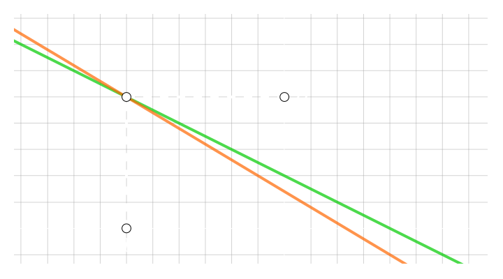
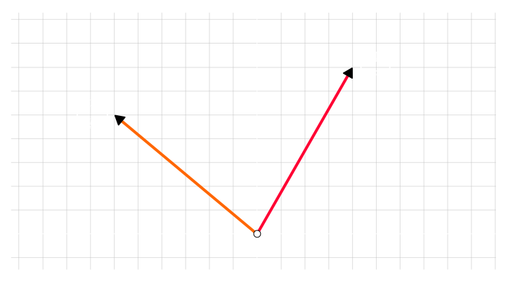
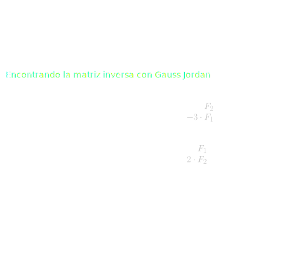
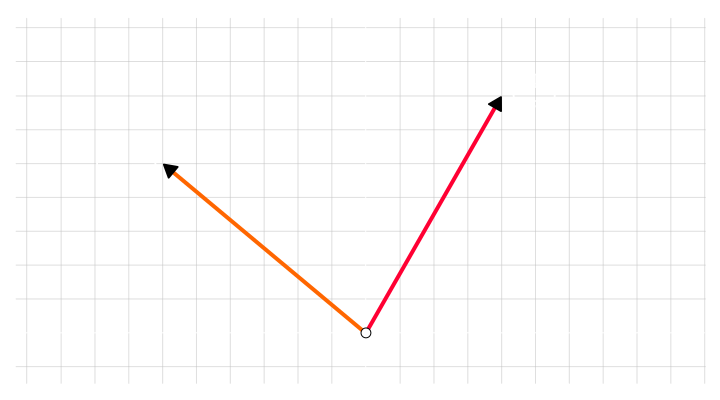

## Sistemas de ecuaciones con matrices

Dado un sistema de ecuaciones
$$
\large{
    \left\{
        \begin{array}{l}
            x + 2 \cdot y = 4
            \\\\
            3 \cdot x + 5 \cdot y = 7
        \end{array}
    \right.
}
$$

Podemos escribirlo como un **producto de matrices**

$$
\large{
    \underbrace{
        \left(
            \begin{array}{rrr}
                1 & 2
                \\
                3 & 5
            \end{array}
        \right)
    }_{\displaystyle{A}}
    \cdot
    \underbrace{
        \left(
            \begin{array}{r}
                x \\ y
            \end{array}
        \right)
    }_{\displaystyle{\vec{\text{x}}}}
    =
    \underbrace{
        \left(
            \begin{array}{r}
                4 \\ 7
            \end{array}
        \right)
    }_{\displaystyle{\vec{\text{v}}}}
}
$$

Donde

- $A$ es la `matriz de coeficientes`
  
- $\vec{\text{x}}$ es la `matriz de incognitas`
  
- $\vec{\text{v}}$ es la `matriz de terminos independientes`

Y en vez de pensar en **2 rectas que se intersectan** en un punto $(x, y)$

podemos pensar que en que:

$A$ es una `transformacion lineal del espacio` que cuando la que **aplicamos** al `vector incognita` $\vec{\text{x}}$ obtenemos el `vector resultado` $\vec{\text{v}}$

$A$ **transforma** el espacio del **convirtiendo** al **vector** $\vec{\text{x}}$ en el **vector** $\vec{\text{v}}$

$$
\Large{
    A \cdot \vec{\text{x}} = \vec{\text{v}}
}
$$

<video src="./transformacion-vectores.mp4" loop muted autoplay controls></video>

 

#### Transformacion inversa

Para encontrar cuanto vale el vector $\vec{\text{x}}$ antes de **aplicar la transformacion** $A$

debemos aplicar la `transformacion inversa` $A^{-1}$ al **vector** $\vec{\text{v}}$

$$
\Large{
    A^{-1} \cdot \vec{\text{v}} = \vec{\text{x}}
}
$$

Encontrar la `transformacion inversa` es calcular la `matriz inversa` de $A$

Aplicamos la `transformacion inversa`

$$
\begin{array}{c}
    \begin{pmatrix}
        -5 & 2 \\ 3 & -1
    \end{pmatrix}
    \cdot 
    \begin{pmatrix}
        4 \\ 7
    \end{pmatrix}
    =
    \begin{pmatrix}
        x \\ y
    \end{pmatrix}
    \\\\
    \begin{pmatrix}
        -5 \cdot 4 + 2 \cdot 7 \\ 3 \cdot 4 -7
    \end{pmatrix}
    =
    \begin{pmatrix}
        x \\ y
    \end{pmatrix}
    \\\\
    \begin{pmatrix}
        -20 + 14 \\ 12 - 7
    \end{pmatrix}
    =
    \begin{pmatrix}
        x \\ y
    \end{pmatrix}
    \\\\
    \begin{pmatrix}
        -6 \\ 5
    \end{pmatrix}
    =
    \begin{pmatrix}
        x \\ y
    \end{pmatrix}
\end{array}
$$
 

finalmente las **coordenadas** el `vector incognita` $\vec{\text{x}}$ y soluciones son

$$
\Large{
    x = -6 \hspace{3em} y = 5
}
$$

 

### Ejemplo 3D

Dado un sistema de ecuaciones
$$
\large{
    \left\{
        \begin{array}{l}
            x + 2 \cdot y + z = 7
            \\\\
            3 \cdot x + y + z = 5
            \\\\
            2 \cdot x + 3 \cdot y - z = 3
        \end{array}
    \right.
}
$$

Podemos escribirlo como un **producto de matrices**

$$
\large{
    \underbrace{
        \left(
            \begin{array}{rrr}
                1 & 2 & 1
                \\
                3 & 1 & 1
                \\
                2 & 3 & -1
            \end{array}
        \right)
    }_{\displaystyle{A}}
    \cdot
    \underbrace{
        \left(
            \begin{array}{r}
                x \\ y \\ z
            \end{array}
        \right)
    }_{\displaystyle{\vec{\text{x}}}}
    =
    \underbrace{
        \left(
            \begin{array}{r}
                7 \\ 5 \\ 3
            \end{array}
        \right)
    }_{\displaystyle{\vec{\text{v}}}}
}
$$

<video src="./transformacion-vectores-3d.mp4" loop muted autoplay controls></video>

> $A$ **transforma** el espacio del **convirtiendo** al **vector** $\vec{\text{x}}$ en el **vector** $\vec{\text{v}}$

#### Las soluciones del sistema

$$
\large{
    x = 0 \hspace{2em} y = 2 \hspace{2em} z = 3 \hspace{2em}
    \vec{\text{x}} = 
    \left(
        \begin{array}{r}
            0 \\ 2 \\ 3
        \end{array}
    \right)
}
$$

  

#### Docs

- [Matriz inversa, rango y rango nulo](https://www.youtube.com/watch?v=Xt_0OyLdQgI)