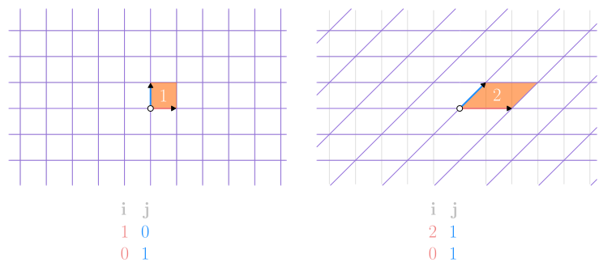
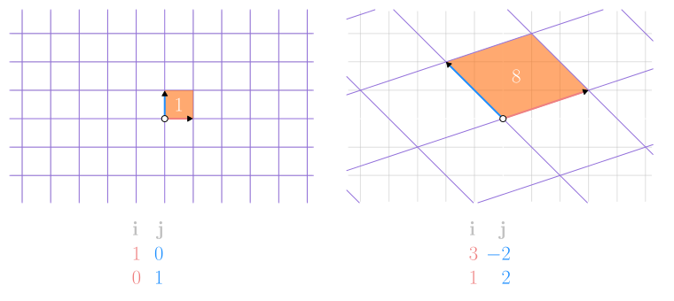
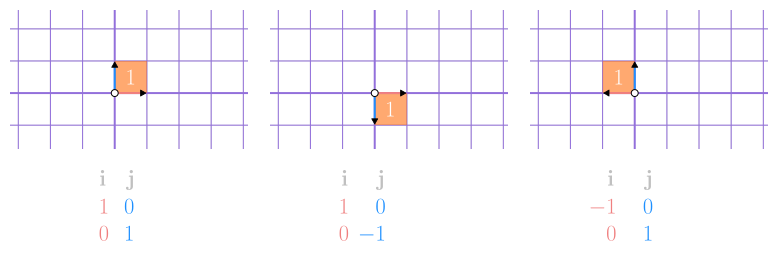
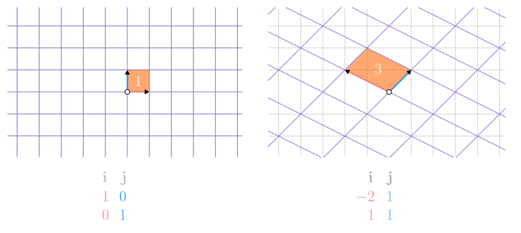
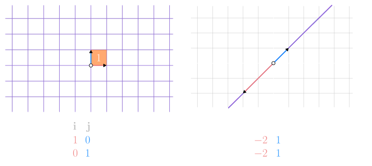

## Determinante en Transformaciones del espacio

Pensando en las `matrices` como `transformaciones del espacio`

El **valor absoluto** del `determinante` de una **matriz** nos dice el `factor de cambio` de la `transformacion`

En **matrices** $2 \times 2$: cuanto se **incrementa** o se **reduce** el `area` luego de aplicar la `transformacion`

<video src="./determinante-transformacion-1.mp4" muted autoplay controls loop></video>

<video src="./determinante-transformacion-2.mp4" muted autoplay controls loop></video>

En **matrices** $3 \times 3$: cuanto se **incrementa** o se **reduce** el `volumen` luego de aplicar la `transformacion`

<video src="./determinante-transformacion-5.mp4" muted autoplay controls loop></video>

 

### Determinante negativo

Cuando el `determinante` es **negativo** la `transformacion` ha provocado un **cambio de orientacion**

<video src="./determinante-transformacion-3.mp4" muted autoplay controls loop></video>

 

### Determinante 0

Cuando el `determinante` es $0$ la `transformacion` a **reducido** el espacio a una **dimension inferior**

En el caso de **matrices** $2 \times 2$ donde **transformamos un plano 2D** este se reduce a una `linea` o un `punto`

<video src="./determinante-transformacion-4.mp4" muted autoplay controls loop></video>

En el caso de **matrices** $3 \times 3$ donde **transformamos el espacio 3D** este se reduce a un `plano`, una `linea` o un `punto`

<video src="./determinante-transformacion-6.mp4" muted autoplay controls loop></video>

  

#### Docs

- [El determinante | Esencia del álgebra lineal, capítulo 5](https://www.youtube.com/watch?v=yt3eoYvGel0)
  
