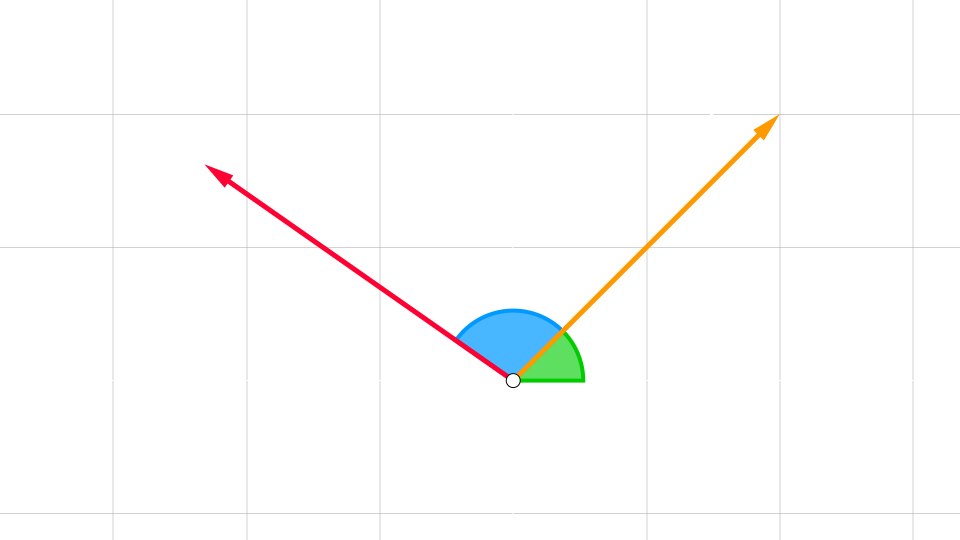

## Rotanto un vector

Dado un **vector** $\vec{a} = (x_{0}, y_{0})$ 

podemos encontrar un **vector** 
$\vec{b}$ que forme un angulo $\alpha$ con $\vec{a}$ 

`transformando` el **vector** $\vec{a}$ mediante la `matriz rotacion`

$$
\left(\begin{array}{rr}
    \cos(\alpha) & - \sin(\alpha)
    \\
    \sin(\alpha) & \cos(\alpha)
\end{array}\right)
\cdot
\left(\begin{array}{rr}
    x_{0}
    \\
    y_{0}
\end{array}\right)
=
\left(\begin{array}{rr}
    \cos(\alpha) \cdot x_{0} - \sin(\alpha) \cdot y_{0}
    \\
    \sin(\alpha) \cdot x_{0} + \cos(\alpha) \cdot y_{0}
\end{array}\right)
$$
 

de modo que las componentes del **vector** $\vec{b}$ son 

$$
    \vec{b} = \left\{\begin{array}{l}
        x = \cos(\alpha) \cdot x_{0} - \sin(\alpha) \cdot y_{0}
        \\\\
        y = \sin(\alpha) \cdot x_{0} + \cos(\alpha) \cdot y_{0}
    \end{array}\right.
$$

<video src="./rotando-un-vector.mp4" muted loop controls autoplay></video>