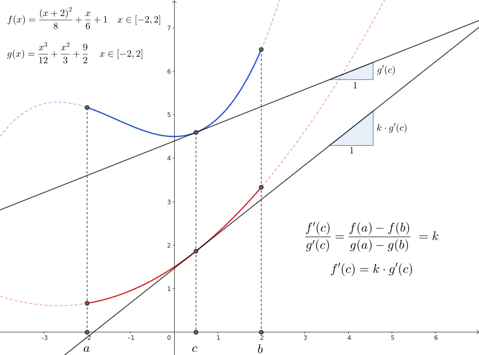
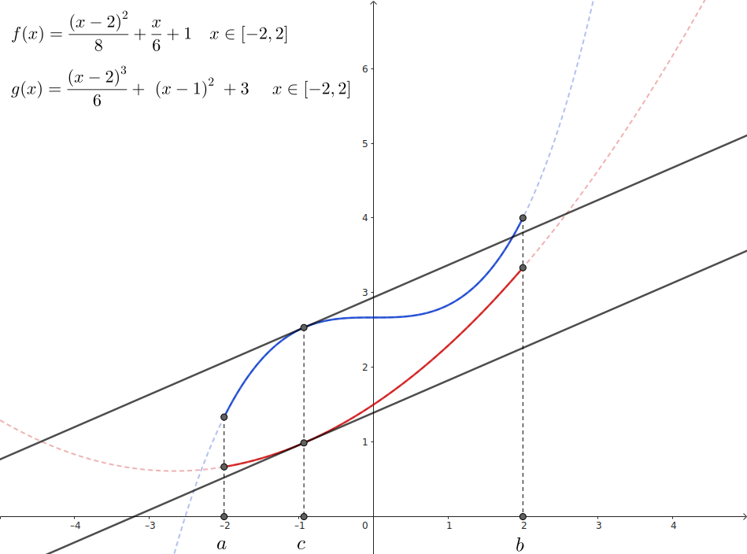
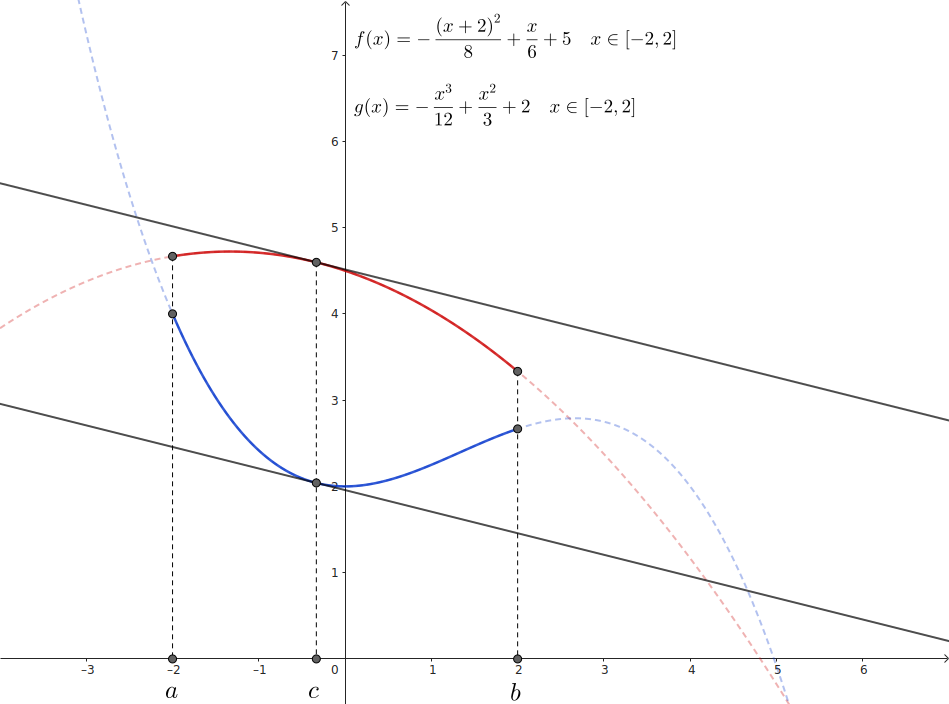
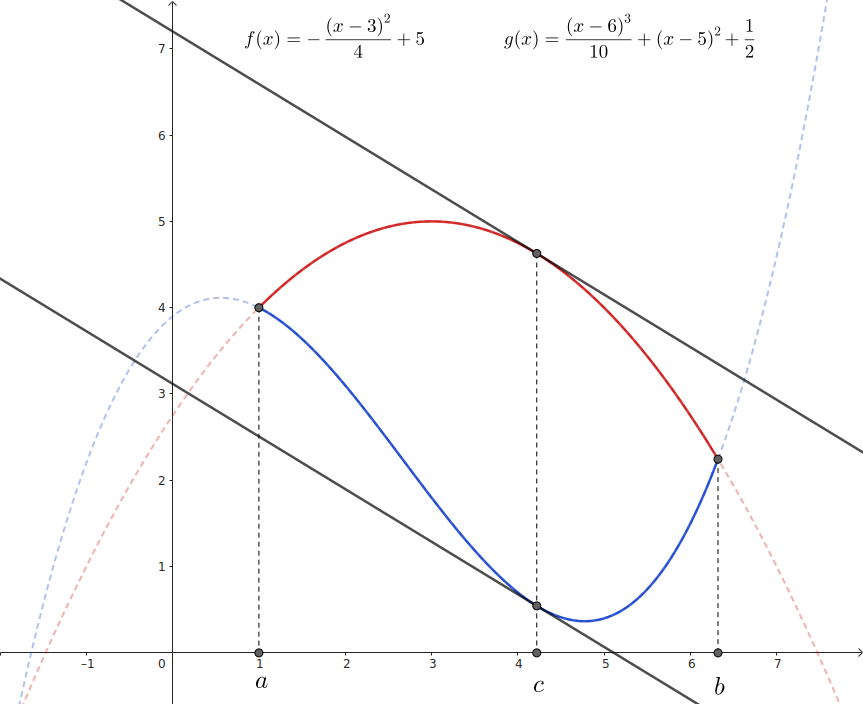

## Teorema de Cauchy

Dadas 2 funciones $f(x)$ y $g(x)$ que son:

- `continuas` en el **intervalo cerrado** $[a, b]$
- `derivables` en el **intervalo abierto** $(a, b)$

**Existe** al menos un punto $c$ en el **intervalo abierto** $(a, b)$ que cumple que:

$$
    [f(b) - f(a)] \cdot g'(c) = [g(b) - g(a)] \cdot f'(c)
$$

 

Si ademas $g(b) \neq g(a)$ y $g'(c) \neq 0$ entonces:

El **cociente** de las `derivadas` en $c$ es igual al **cociente** de las diferencias de los **extremos del intervalo**

$$
    \large{
        \frac{f'(c)}{g'(c)} = \frac{f(b) - f(a)}{g(b) - g(a)}
    }
$$

 

#### Tambien se entiende como:

El **cociente** de las pendientes de las `rectas tangentes` es igual al **cociente** de las pendientes de las `rectas secantes`

$$
    \begin{array}{c}
        \displaystyle{
            \frac{f'(c)}{g'(c)} = \frac{
                \dfrac{f(b) - f(a)}{b - a}
            }{
                \dfrac{g(b) - g(a)}{b - a} 
            } 
        }
        \\\\
        \displaystyle{
            \frac{f'(c)}{g'(c)} = \frac{
                \dfrac{f(b) - f(a)}{\cancel{b - a}}
            }{
                \dfrac{g(b) - g(a)}{\cancel{b - a}} 
            }
        }
        \\\\
        \displaystyle{
            \frac{f'(c)}{g'(c)} = \frac{f(b) - f(a)}{g(b) - g(a)}
        }
    \end{array}
$$
 

### Interpretacion geometrica

$$
    \begin{array}{c}
        \displaystyle{
            \frac{f'(c)}{g'(c)} = \frac{f(b) - f(a)}{g(b) - g(a)}
        }
        \\\\
        \displaystyle{
            \frac{f'(c)}{g'(c)} = k
        }
        \\\\
        \displaystyle{
            f'(c) = k \cdot g'(c)
        }
        \\\\
    \end{array}
$$

Las `rectas tangentes` a la funciones en los puntos $\{c, f(c)\}$ y $\{c, g(c)\}$ son **proporcionales** en $k$ veces

 

## Tangentes paralelas

En un **caso especial** donde:

$$
    \frac{f'(c)}{g'(c)} = \frac{f(b) - f(a)}{g(b) - g(a)} = 1
$$

de modo que:

**Existe** al menos un punto $c$ en el **intervalo abierto** $(a, b)$ donde 

Las `rectas tangentes` a las funciones en los puntos $\{c, f(c)\}$ y $\{c, g(c)\}$ son **paralelas**

$$
    f'(c) = g'(c)
$$

Se puede dar de manera natural

O siempre que $f(a) = g(a)$ y $f(b) = g(b)$

 

## Teorema del valor medio generalizado

Cuando $g(x) = x$ el `teorema del valor medio de Cauchy` queda reducido al `teorema del valor medio de Lagrange`

$$
    \begin{array}{c}
        \displaystyle{
            \frac{f'(c)}{g'(c)} = \frac{f(b) - f(a)}{g(b) - g(a)}

            \hspace{2em}

            \begin{array}{l}
                g(a) = a
                \\\\
                g(b) = b
                \\\\
                g'(x) = 1
            \end{array}
        }
        \\\\
        \displaystyle{
            \frac{f'(c)}{1} = \frac{f(b) - f(a)}{b - a}
        }
        \\\\
        \displaystyle{
            f'(c) = \frac{f(b) - f(a)}{b - a}
        }
        \\\\
    \end{array}
$$

Por esto se lo llama `Teorema del valor medio generalizado`

 